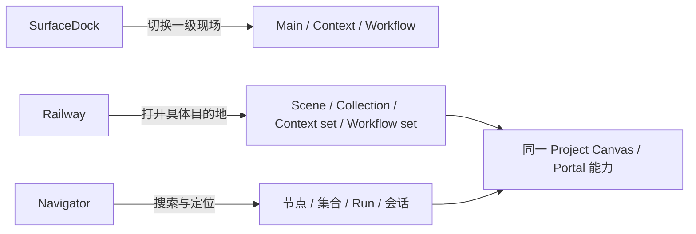

# LCOS Gen2 · FigmaCode S2 REBASED 代码、运行与 Shell 语义审计

日期：2026-09-14  
审计对象：`C:\Users\1\Desktop\前端冲刺\LCOS_GEN2_FigmaCode_S2_REBASED_20260914.patch`  
Patch SHA256：`67CE7350DF7D5CA9E00C6F5BF7B54083300A2EA69DB8A9F1950D975A87C43951`  
声明基线：`f3c1a5f3f8e2dbc97d9540f5c3fdfdbec050a06d`  
当前生产 checkout（只读核查）：`frontend-reconstruction-v2@ef4c214`  
审计动作：未修改生产源码、未提交、未 push。

## 结论

**这份 patch 不能原样应用或合并。它的节点视觉实现值得保留，但目前同时存在补丁不可应用、真实投影中断和 Shell 语义未覆盖三个独立问题。**

用户当前看到“左侧和底部还是 DeepSeek 那套错误理解”，原因已经由源码直接确认：

- S2 patch 没有修改 `LcosProjectShell`、`LcosGlobalHud`、`LcosRailway`、`LcosSurfaceDock`、`useLcosWorksiteNav`；
- 当前 `LcosRailway` 把 `LCOS_SURFACES` 直接变成左侧按钮；
- 底部 `LcosSurfaceDock` 也把同一份 `LCOS_SURFACES` 变成按钮；
- 两者调用同一个 `switchWorksite()`。

因此左边和底部现在是**同一功能画了两遍**。这不是 LCOS 的规划，也不是用户最新裁决。

## 1. 当前错误到底在哪里

### 1.1 左侧 Railway 被写成了第二套三现场开关

当前文件：

`E:\OS开发\LCOS_Gen2\huabu\apps\web\src\lcos\shell\LcosRailway.tsx`

硬证据：

- 第 1–3 行把 Railway 描述成“三现场导航”；
- 第 10 行引入 `LCOS_SURFACES`；
- 第 28 行调用 `useLcosWorksiteNav`；
- 第 54–60 行用 `LCOS_SURFACES.map(...)` 生成 Main / Context / Workflow；
- 第 67–70 行点击后直接调用 `switchWorksite()`；
- Core 返回的 `orderedRefs` 只在第 41–43 行被压成一句“+N 个长期现场”，真实目的地根本没有渲染。

也就是说，已有的 Railway 数据契约被读到了，但只拿来显示计数；真正展示的却是三枚静态 Surface 图标。

### 1.2 底部 SurfaceDock 本来才是三现场入口

当前文件：

`E:\OS开发\LCOS_Gen2\huabu\apps\web\src\lcos\shell\LcosSurfaceDock.tsx`

硬证据：

- 第 1–2 行明确写着“底部常驻现场切换”；
- 第 65–89 行渲染 `Main / Context / Workflow`；
- 点击同样走 `switchWorksite()`。

这部分语义本身正确。问题不是底部有三个入口，而是左侧又复制了一遍。

### 1.3 错误被进一步写进共享 Hook 的自我描述

当前文件：

`E:\OS开发\LCOS_Gen2\huabu\apps\web\src\lcos\app\useLcosWorksiteNav.ts`

第 1 行直接写成：

```text
Dock / Railway / Navigator 共用同一逻辑
```

这会继续误导后续 Agent，以为 Railway 天生就是 Surface Switcher。该注释和调用关系都需要纠偏。

## 2. 正确产品语义

权威规划已经区分得很清楚：

| 组件 | 回答的问题 | 数据来源 |
|---|---|---|
| SurfaceDock | “我现在要去 Main、Context 还是 Workflow？” | 固定三 Surface + 当前 Canvas/Workspace 映射 |
| Railway | “这个项目里有哪些可持续返回的具体目的地？” | Core 持久化的 `ProjectViewRailOrderV0.orderedRefs` |
| Navigator | “我要找的对象在哪，并把相机带过去。” | 搜索/定位 projection |
| Assembly | “项目共享材料与集合在哪里管理、投放和接收？” | Core Assembly / Receiver contracts |

`ProjectViewRailRefV0` 的真实结构是：

```ts
type ProjectViewRailKindV0 =
  | 'scene'
  | 'collection'
  | 'context'
  | 'workflow';

interface ProjectViewRailRefV0 {
  kind: ProjectViewRailKindV0;
  viewId: string;
}
```

这里的 `context` / `workflow` 是**某一个具体目的地的种类**，不是把 Context / Workflow 根 Surface 再做一遍。Railway 必须按 `viewId` 展示和激活具体目的地，并保存用户排序。

正确关系：



## 3. Railway 的最小源码纠偏方案

### 保留

- 保留 `LcosRailwayView` 这个纯视图组件；
- 保留 `CoreRailwayClient.read/write`；
- 保留 `ProjectViewRailOrderV0` 和 `ProjectViewRailRefV0`；
- 保留 Huabu 的唯一 Canvas、selection、camera 与 geometry runtime；
- 保留 SurfaceDock 当前三现场切换控制器。

### 从 Railway 删除

从 `LcosRailway.tsx` 删除：

- `LCOS_SURFACES`；
- `LcosSurfaceKey`；
- `SURFACE_ICON` 静态三图标映射；
- `canvasBySurface` / `ensureCanvas` props；
- `useLcosWorksiteNav()`；
- 点击即 `switchWorksite()` 的逻辑；
- “+N 个长期现场”代替真实内容的占位实现。

### 接入真实目的地

`LcosRailway` 应：

1. 用 `CoreRailwayClient.read(projectId)` 读取 `orderedRefs`；
2. 按 `kind + viewId` 解析现有 Core 实体的标题、图标、可用状态和目标引用；
3. 将每条真实目的地传给 `LcosRailwayView`；
4. 点击后调用“目的地激活”适配层：
   - 已投影目的地：复用现有 Locate / Portal / Worksite activation；
   - 未投影但可打开：复用现有 Portal / Professional Window；
   - 已失效引用：如实 disabled，并提供移除/修复入口；
5. 重排只调用 `CoreRailwayClient.write({ orderedRefs, expectedVersion })`，不把 truth 放进 Zustand 或 localStorage；
6. Receive 只打开既有 Receiver 能力，不在 Railway 再造一套接收协议。

`LcosGlobalHud` 需要拆开 props：SurfaceDock 继续拿 `canvasBySurface/ensureCanvas`；Railway 只拿项目和目的地解析/激活能力。

### 最小验收

- SurfaceDock 恰好提供 Main / Context / Workflow 三个一级入口；
- Railway 数据为空时，不得凭空出现 Main / Context / Workflow；
- Railway 有四条 `orderedRefs` 时，按 Core 顺序显示四个具体目的地；
- 点击 Railway 目的地不能因为其 `kind='context'` 就等同于点击 Context 根 Surface；
- reload 后顺序恢复；
- 无效 `viewId` 不跳错位置、不伪造成功；
- Railway 与 SurfaceDock 不再共用 `switchWorksite()` 作为唯一动作。

## 4. S2 patch 自身的三个阻断

### 4.1 补丁不能在声明基线干净应用

在干净 `f3c1a5f` worktree 上：

| 命令 | 结果 |
|---|---|
| `git apply --check` | FAIL |
| `git apply --check --recount` | FAIL |
| `git apply --reject --recount` | 大部分应用，`NoteNode.tsx` 四个 hunk 被拒绝 |

因此“REBASED”目前只是文件名，不是可验证事实。应交付真实分支/commit，或从正确基线重新导出 patch，并要求 `git apply --check` 为零错误。

### 4.2 Audio 投影使用了 Huabu 不接受的节点类型

S2 把音频视觉族解析为 `audio`，随后强制断言为 `AgentCreatableNodeType`。但真实 Huabu 的可创建类型没有 `audio`。

真实运行结果：

```text
CREATE_NODES(audio)
→ Huabu RFS HTTP 400
→ projectArtifacts() 抛错
→ ReconciliationRunner 整轮中断
→ 后续 Glyth / LCOS body binding / staging 没完成
→ 页面显示原生 Huabu 白卡和 AI badge
```

这正是“看起来仍然是 Huabu 原界面”的直接运行原因。

建议复用现有中性宿主：

- 音频 LCOS 节点投影为已有 `note` host；
- `AudioSourceMorphology` 继续拥有最终视觉；
- staging 允许 `stageKind='audio' && node.type='note'`，写入真实音频 `src`；
- 类型解析函数直接返回真实 `AgentCreatableNodeType`，禁止强制 cast 掩盖契约不一致；
- 增加一条测试：所有 resolver 输出必须属于真实 create-node schema。

### 4.3 单个节点失败会让整批投影停摆

真实 RFS 已经创建前七个节点，第八个 audio 才 400；服务端行为是部分成功。当前 Runner 却因一个异常停止 Glyth 和其余 binding。

修复要求：

- 每个投影项独立记录 success/failure；
- 单项失败后继续处理其余合法项；
- retry 只重试失败项，不能重复创建已成功节点；
- 最终回执明确列出失败实体和原因。

这不是为了“多加一层 gate”，而是已经发生的跨批次部分成功失败场景。

## 5. 数据正确性缺口

### ArtifactView 不能取数组第一项

当前实现对每个 Artifact 取第一条有效尺寸的 View，没有使用当前 Scope / Workspace / membership。

失败场景：同一图片在 Main 是 `410×273`，在 Context/Assembly 是 `205×127`；数组顺序一变，Main 就会拿到缩略图尺寸。

应先明确当前投影的 Scope/Workspace，再按目标 scope 选择 View；若 Main 确实是 project-level projection，也必须定义稳定的选择规则，不能依赖 API 数组顺序。

### MIME 不能取第一条 Revision

当前 MIME 由第一条匹配的 `artifactRevision` 决定，没有优先使用：

```text
selected ArtifactView.revisionId
→ Artifact.currentRevisionId
→ 明确 unavailable
```

失败场景：旧 revision 是 image，current revision 是 audio；数组顺序一变，节点物种跟着变。

需要通过 `revisionById → fileRecordById` 精确 join，并补反转数组顺序测试。

### 旧画布 geometry 不会自动变成 Figma 尺寸

S2 只给“新投影节点”设置 Figma 初始尺寸；已有持久化坐标/尺寸被正确保护，不会偷偷覆盖。

因此验收必须二选一：

- 使用 fresh canvas 验证新节点；
- 或提供一次显式、可预览、只处理未被用户改动的系统/demo 节点迁移。

不能拿旧 demo canvas 截图证明 S2 是否生效，也不能静默重排用户画布。

## 6. 代码质量与 Figma 还原结论

### 值得保留的实现

- `NodeWrapper` 仍拥有 drag / resize / selection / handles / LOD；
- LCOS body 通过现有 seam 注入，没有第二套 Canvas store/runtime；
- Core-bound 节点可以透明宿主、隐藏旧 AI badge；
- Text / Document / Image / Audio morphology 已拆分，模块边界比旧实现清楚；
- Figma 几何锚点基本对齐：
  - Text `385×142`
  - Document `206×154`
  - Image `410×273`
  - Image thumbnail `205×127`
  - Audio `171×96`
  - Glyth `121×142`，内部 `92×92`
- Audio waveform、Source marker、Action Arc 几何均有明确参数和测试。

### 测试事实

| 检查 | 结果 |
|---|---|
| web-gen2 typecheck（审计恢复后） | PASS |
| web-gen2 tests | 273/273 PASS |
| Huabu targeted tests | 17/17 PASS |
| Huabu TS | patch 原样有 `TS2352`；审计性修复 cast 后 PASS |
| touched Huabu lint | FAIL，17 个 import/order |
| `git diff --check`（审计恢复后） | PASS |
| 真实 `r2-figma-exact-acceptance.mjs` | FAIL，exit 1 |
| 真实 Main morphology | FAIL |
| 真实 geometry persistence | FAIL |
| 浏览器 console / RFS | HTTP 400 |

### 视觉判定

- **静态源码：节点切片明显比 DeepSeek 版本更接近 Figma，方向可保留。**
- **真实运行：没有完成 Figma 复刻。** 因 audio 400 导致 LCOS body 未挂载，页面仍是原生 Huabu 白卡。
- **整页范围：S2 从来没有覆盖 Shell。** Railway、SurfaceDock、Navigator、整体 Main 排布仍继承当前分支，所以不能称为“完整 Main/Figma 实现”。

运行失败截图：


## 7. 正确修复顺序

1. 重新生成能在声明基线通过 `git apply --check` 的交付，优先给真实 branch/commit；
2. 修复 `NodeWrapper` 的 TS cast；
3. 修复 audio neutral host 映射，并用真实 Huabu create schema 测试；
4. 让 reconciliation 支持单项失败后继续，避免半成功批次拖死整轮；
5. 修复 ArtifactView scope 选择和 revision MIME 精确 join；
6. 独立纠偏 Shell：SurfaceDock 唯一负责三 Surface；Railway 改为真实 `orderedRefs` 目的地；
7. 清掉 17 条 touched-file lint；
8. fresh canvas 依次运行 bootstrap、projection、Figma exact E2E；
9. 对照 Figma Main 全图截图复核节点、Railway、Dock、Navigator 和空态，不能只测 selector。

## 8. 合并裁决

```text
当前：DO NOT APPLY / DO NOT MERGE

保留：
- Node host presentation seam
- Source morphologies
- Glyth geometry
- Action Arc geometry
- assertive E2E 方向

修复后再合：
- patch/branch 可应用
- audio 真实 RFS 成功
- reconciliation 不因单项失败整批中断
- view/revision 选择稳定
- Railway 与 SurfaceDock 语义拆开
- fresh canvas Figma exact E2E 通过
```

