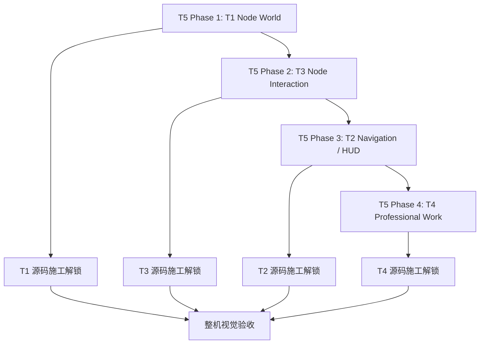

# 「55」对话接管与阶段成果恢复报告

## 1. 接管结果

“55”不是一个已完成的视觉方案对话，而是一条正在纠偏的 T5 视觉施工线。最后明确获批的动作是继续 Phase 1 / Gate A，先恢复 T1 Node World 的 authority、current mechanics、Gen1 完整度下限和 donor 原件，再决定视觉 body；不得先画新的综合 HTML。

## 2. 已恢复的阶段成果

### 2.1 T5 职责已重新收束

T1–T4 已经提供产品语义、UX grammar、状态真相与工程 seam。T5 的职责不是重想这些逻辑，而是：

- 把节点 species、state、LOD、motion 和 spatial choreography 做成成熟视觉系统；
- 用成熟 donor 的真实形态和微状态替换 prototype body；
- 给施工线程提供无需再次做 UI 设计判断的 exact input；
- 最终进行整机视觉验收。

### 2.2 施工顺序已纠正

```text
用户当前明确口径 / 最新冻结
→ Domain / Donor Map
→ 历史 HTML 与 Gen1 完整实现
→ Huabu / Gen2 当前源码
→ Grok / Bloub / iOS donor
→ TapNow / Lovart / Spatial / LibTV / STTIO
→ 原视频 / 逐帧 / bundle / GitHub 原件
→ 成熟 OSS wheel
→ 最后才补 LCOS 独有连接层
```

每个阶段先做 Evidence Census 和 Donor Deep Map，再做可视化母版。

### 2.3 Node World 已成为最高优先级

先前 HTML 过度聚焦 Railway、HUD、Composer、Overlay，节点本体完成度明显低于 Gen1。新的核心验收问题为：

> 不碰顶栏、Railway 和 Composer，只在画布里与节点操作五分钟，它本身是否像一个完整产品？

Phase 1 必须至少覆盖：

- Image、PDF、PPT、Web、Text；
- Collection、Colony、Glyth；
- Skill、Run、Surface Component；
- hover、select、multi-select、resize、LOD、drag、arrange；
- Orbit、Reference、Relation、Semantic Give、right-drag proxy；
- Pin、Focus、Preview、Work View、Archive、Restore；
- Agent live manipulation 与 pending-review。

### 2.4 Gen1 的角色已重定义

Gen1 不是视觉 authority，而是 completeness floor。Gen2 不能只超过它的圆角、阴影和表面风格，必须至少覆盖它完整的节点生命史：

```text
species-specific body
continuous resize
LOD
Image / PDF / PPT / Markdown / Doc
Artifact Location Orbit
Fragment / source return
Preview / WorkView
Text / Outline / Mind Map

> `SUPERSEDED 2026-09-07`：这是原对话恢复出的旧归类。按最新 Huabu `a3c411e` 源码复核，轻量 `TextNode` 是 textarea 物种，不承担 Markdown/Outline/Mind Map；后者应归入 Note/Document professional projections。以 `27_NC-08_Text_Exact_Construction_Card_v1.md` 为准。
Agent workspace takeover
Graph / Timeline / Outline / CanvasLayout
pending review
keep / revert
完整 node lifecycle
```

### 2.5 四阶段流水线已恢复



不是四阶段全部结束后其他线路才开工，而是每个 Phase 冻结后立即解锁对应线路。

## 3. 已恢复的 Phase 1 关键事实

### 3.1 当前 mechanics 并非空白

聊天中已确认过以下实现角色：

- `projectionBinding.ts`：world geometry、authoritative projection、parent、layout、surface binding；
- `projectToSpaceProjection.ts`：canonical 到 spatial projection；
- `NodeWrapper.tsx`：resize、selection、floating toolbar、overlay、FLIP、semantic LOD、takeover；
- `semanticZoom.ts` + `useNodeLOD.ts`：LOD 与 hysteresis；
- `NodeTakeoverLayer.tsx`：缩远时 body 淡出、identity mark 向中心滑动与连续收缩；
- `FrameNode.tsx`：parent/container mechanics；
- `visualFamily.ts`：曾包含 `T5_STATE_STYLE_CONTRACT_PENDING = true`。

但本轮只在仓库的 RC / baseline 副本中重新定位到 `visualFamily.ts`；其余 Huabu 精确路径尚未在当前主工作树中复核。因此这些条目当前不能统一标为 `CURRENT_REPO_VERIFIED`。

### 3.2 已找回的数值基线

以下数值来自“55”对话中此前的源码/材料核验记录，应作为待二次定位的工作基线，而不是永久产品 token：

| 项目 | 基线 |
|---|---:|
| semantic zoom threshold | 150px |
| hysteresis | 10px |
| minimal | 32px |
| compact | 52px |
| default | 76px |
| content motion | 200ms |
| grid | 240ms |
| gap | 220ms |
| stagger | 70ms |
| takeover band | 64px → 24px |
| body opacity band | 64px → 46px |
| mark glide | 60px → 32px |
| collapsed mark | 6px → 30px |
| glide | 200ms ease-out |

### 3.3 Text wheel 结论

此前核验结果为：Milkdown 7.21.1 系列已安装；`react-arborist` 与 `mind-elixir` 未在当时 current repository 找到；历史路径 `huabu/apps/web/src/components/Nodes/TextNodeBody.tsx` 不存在。

当前正确的记录方式：

```text
Milkdown       = PREVIOUSLY_VERIFIED_INSTALLED / NEED_CURRENT_ROOT_RECHECK
react-arborist = PLANNED_NOT_FOUND_CURRENT
mind-elixir    = PLANNED_NOT_FOUND_CURRENT
TextNodeBody   = HISTORICAL_PATH_INVALID
```

不能把三者都写成已经接通。

### 3.4 Spatial 已确认的视觉事实

对话恢复出的一级视觉结论：

- 内容按 intrinsic morphology 存在，而非统一通用卡片；
- focus/presented 是 source object 原位连续变化，不是另开 modal；
- 周围对象会降权、让位、聚散和 settle；
- video、text、image 可异构混排；
- folder/stack/fan/rearrangement 构成 Collection 重要证据；
- 文本、selection handles、drag manipulation 在原始画面中可见。

此前报告数值包括 `约 250ms focus`、邻居 `scale≈.96 / opacity≈.4 / displacement≈8–16px`、多卡入场 `约 550ms`。这些必须继续标为 `REPORT_MEASURED`，不能冒充源码 token。

### 3.5 Grok / Bloub 状态

本轮在桌面真实定位到：

`C:\Users\1\Desktop\Gen2开发\grok-icon-study_replica_20260903\`

包含 `geometry-data.js`、`src/eyes.js`、`src/character.js`、`src/pose.js`、`src/tables.js` 等可继续 census 的原件。Phase 1 只消费 Glyth body、morphology、eyes、gaze、blink、presence；完整 selection / Orbit / Composer / right-drag 留到 Phase 2。

## 4. 仍未完成

1. 找到本轮所称 Huabu/current renderer 的唯一可信源码根目录；
2. 逐项核 Image / PDF / PPT / Web / Text 的 current renderer；
3. 将 `lcos-seam` / `nodePresentation` 与具体 renderer 对齐；
4. 完成 Grok replica 逐文件 census；
5. 定位并分类 `ios26-control-script`、`swiftui-glass`；
6. 定位 DomainMap、STTIO 的 exact material；
7. 将 Spatial 六段视频/80 帧整理成 state-frame ledger；
8. 完成 Gate A 的完整七件套与 PASS/HOLD 裁决。

## 5. 诚实状态

- 已完成：对话上下文接管；阶段方向、责任、顺序、主要发现恢复；license override 恢复；关键缺口识别。
- 部分完成：current mechanics census、Spatial ledger、Gen1 completeness ledger、donor inventory。
- 未完成：逐证据路径闭环、完整 state matrix、exact construction cards、Gate A PASS。
- 未进行：源码修改、HTML 母版、浏览器视觉验收。
