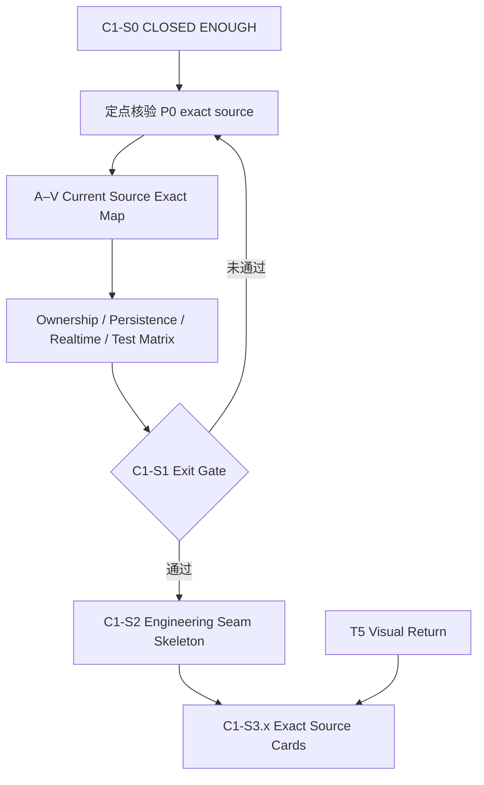

# LCOS Gen2 · T6
# 663 对话接管与颗粒度审计报告

**日期：2026-09-07**  
**接管线程：663**  
**职责：Core / Realtime / Modularity / Migration**  
**性质：独立接管报告；不修改项目仓库；不授权 production patch**

---

## 0. 结论先行

663 的上下文已经恢复到可继续工作的程度，没有必要重新开始全量考古。

当前真实状态：

```text
T6 C1-S0 Mandatory Read / Evidence Census
= CLOSED ENOUGH

T6 → T5 三份前置输入
= 已存在，颗粒度足够供 T5 继续

T6 C1-S1 Current Source Exact Map
= 尚未独立成稿
= 当前只有证据账和对话中的零散闭合结果
= 不足以宣布完成，也不足以直接跳到 C1-S2

T6 C1-S2 Source Engineering Seam Skeleton
= NOT FORMALLY OPENED

T6 C1-S3.x Formal Exact Source Construction Plans
= NOT STARTED

Production Patch
= NOT STARTED / NOT AUTHORIZED
```

因此接管后的正确动作不是重写三份 T5 输入，也不是继续泛读旧材料，而是：

```text
定点闭合尚缺 exact-source 链路
→ 完成 A–V 全职责域 Current Source Exact Map
→ 完成统一 owner / producer / consumer / persistence / realtime / test 矩阵
→ 通过 C1-S1 exit gate
→ 再进入 C1-S2
```

---

## 1. 已恢复的接管材料

### 1.1 663 对话导出

```text
C:\Users\1\Desktop\663\663.md
C:\Users\1\Desktop\663\663.docx
```

该导出保存了会话后段的真实断点，包括：

- C1-S0 已达到 `CLOSED ENOUGH`；
- C1-S1 已进入 formal drafting，但未输出文件；
- ResultSlot、Delete/Archive、ProjectEvent、Railway 等最新状态；
- Gen2 pinned commit；
- 下一轮应定点闭合的具体链路。

### 1.2 C1-S0 Living Checkpoint

```text
C:\Users\1\Desktop\663\LCOS_Gen2_T6_C1-S0_MandatoryRead_EvidenceCensus_LivingCheckpoint_20260906.md
```

该文件是有效接管锚点，但它明确声明：

```text
不是 C1-S1
不是源码施工稿
不授权 production patch
```

### 1.3 已形成的 T6 → T5 三份输入

```text
C:\Users\1\Desktop\接续包\LCOS_Gen2_T6_to_T5_01_StableTruth_StateBoundary_20260906.md
C:\Users\1\Desktop\接续包\LCOS_Gen2_T6_to_T5_02_VisualState_InteractionConstraint_Matrix_20260906.md
C:\Users\1\Desktop\接续包\LCOS_Gen2_T6_to_T5_03_SourceSeam_Donor_ImplementationInput_20260906.md
```

三份分别覆盖：

1. canonical truth 与状态边界；
2. 视觉/交互状态矩阵；
3. source seam、donor 复用边界与 T5 回灌要求。

它们已经足够支持 T5 继续视觉研究和最终方案收敛，不需要等待 T6 C1-S1 才能开工。

---

## 2. 颗粒度审计

### 2.1 对 T5 的输入：够

三份 T6 → T5 输入已经清楚区分：

- Canonical Entity；
- Membership / Composition；
- Projection / Mapping；
- Spatial Body / Geometry；
- Archive / Restore / Delete / Remove Projection / Remove Membership；
- authoritative projection / reference / proxy；
- Collection / Colony / Workflow / Worksite；
- Assembly router-not-owner；
- Skill one-run selection / durable capability-use；
- T5 可以决定与不得决定的边界。

这层的目标是让 T5 不误画产品 truth，不要求达到 exact construction card 的源码深度。按这个目标，颗粒度已经够。

### 2.2 对 T6 C1-S1：不够

当前 C1-S0 Checkpoint 约 821 行，主要是证据恢复账和若干 current-source 事实。它尚未达到 T3 C1-S1 的完整地图标准。

缺少的不是篇幅，而是统一建账结构。T6 每个职责域都必须稳定回答：

```text
exact current file
exact symbol
current owner
exact producer
exact consumer
persistence
realtime / invalidation consumer
current behavior
existing primitive
current test evidence
historical donor（如相关）
Phase B target
mismatch classification
status
```

当前材料中，部分章节只有 file 或行为结论，没有完整 symbol、consumer、test、restart/reconnect evidence；另一些结论仍散落在对话里，尚未进入统一矩阵。

### 2.3 对 T6 正式施工卡：明显不够

T4 C1-1 的标准是一张卡只解决 1–2 条强耦合 seam，但继续追到：

```text
exact MODIFY / ADD / KEEP / RETIRE
exact symbol
before / target behavior
call chain
lifecycle / transaction / event order
race / idempotency / failure mode
compat read / retire write / migration fixture
unit / integration / browser / restart acceptance
recovery / rollback / blast radius
implementation sequence / Done checklist
```

T6 尚未进入这一层。旧 Engineering Seam Skeleton 已在 663 中被正确降级为 working hypothesis ledger，不得冒充正式 C1-S2 或 C1-S3。

---

## 3. 已经闭合、可直接进入 C1-S1 的事实

### 3.1 Project identity

```text
PROJECT_ID ?? 'disposable-mvp-sample'
```

仍存在于 current composition 上游；现有 runtime 已支持 retarget/dispose。问题是 upstream Project identity wiring，不是重写 Project Runtime。

### 3.2 ProjectionBinding

现有 identity seam 可保留；它不应持有 geometry 或 membership。Phase B 的 authoritative projection uniqueness 与 current unique-key 方向一致。

### 3.3 Reconciliation

当前 reconciliation 从 project graph 枚举 artifact，但 projection eligibility / archived filtering 未完整进入 source census。Archive 不能只删 Huabu node，否则 restart/reconcile 可能重新投影。

### 3.4 Delete 不等于 Archive

ArtifactView / Note 当前 DELETE 属于 `MutationSafetyService` destructive delete + ChangeSet inverse。

```text
Undo destructive delete
≠
Archive 保留同一 canonical entity lifecycle
```

### 3.5 ProjectEvent / recovery

Core 侧已证明：

```text
runtimeId
projectSeq
replay
snapshot_required
heartbeat
bounded retention
runtime-local mutation receipt
```

但统一 Web production consumer 仍是 `CONSUMER_NOT_PROVEN`。搜索无结果不得写成源码不存在。

### 3.6 ResultSlot

`ResultSlotService` 生命周期已证明包含：

```text
create → claim → markReview → materialize / release / remove
```

并有幂等和跨 Run 冲突保护。

同时仍存在：

- `RuntimeApplicationService.create()` 接收 `resultSlotId`，但未证明已 persist / claim；
- production `markReview()` caller 尚未钉死；
- ResultSlot persistence 仍夹带 `scopeId / workspaceId / x / y / width / height`。

因此分类应为：

```text
KEEP lifecycle primitive
THIN_GAP in Run wiring
OWNER_SPLIT / LEGACY_WRITER in spatial ownership
```

### 3.7 RFS live sync

历史的“后台写后 Canvas 不自动刷新”已被 current source 反证。当前链路已经覆盖 execute、persistence、publish、SSE 和 Web installation，应标为 `CURRENT_WIRED`，不能沿用旧失败结论。

### 3.8 Railway

`/view-rail-order` 暂保持：

```text
CURRENT_SOURCE_PARTIAL
CROSS_THREAD_TO_PIN
```

它主要属于 T2；T6 只记录 durable persistence / CAS / ontology compatibility 边界，不为追 T2 consumer 扩大本线程考古。

---

## 4. C1-S1 仍需定点闭合的内容

优先级 P0：

1. `RuntimeApplicationService`：Run create 与 `resultSlotId` persistence / claim；
2. `RuntimeReviewService`：accept / materialize 链；
3. ResultSlot `markReview()` 的真实 production caller；
4. ActiveContext route / service / persistence / producer / consumer / realtime；
5. Runtime supplier：`RuntimeAdapterService / BridgeRuntimePort / RuntimeBinding`；
6. Assembly：typed target、current mapper、legacy Scope coupling、mutation owner；
7. ProjectEvent 统一 Web production consumer；
8. Archive / Restore exact lifecycle insertion point。

优先级 P1：

9. Railway durable order 的 T6 边界；
10. Huabu cross-space / write coordinator / storage / RFS 的 T6 mechanics；
11. Gen1 R3-A Colony donor 的必要 historical pin；
12. table-by-table legacy writer / compat-read / retire-write；
13. current unit / integration / browser / restart / reconnect evidence map；
14. Search / RAG / Agent / Persistence ownership matrix。

不再主动扩大：

- 全量重读 66 / 662；
- 全量 0902 / 0903 考古；
- donor 全仓逐文件阅读；
- 已被 Phase B 关闭的产品语义；
- T2/T3/T4/T5 的非 T6 owner 领域。

---

## 5. 接管后的执行路线



### C1-S1 Exit Gate

只有同时满足以下条件才可宣布完成：

- A–V 职责域全部有状态；
- 关键结论有 exact file 与 exact symbol；
- producer / owner / consumer 不混写；
- persistence 与 realtime/recovery 分开记录；
- legacy / current / donor / target 分层；
- 搜索未命中只标 `NOT_PROVEN`；
- cross-thread consumer 明确标记，不越权代做；
- current tests 与缺失测试均建账；
- 不写 patch，不提前发明新 service/store/event bus；
- 输出下一轮 seam family 输入。

---

## 6. 当前需要 Dz 补充的材料

现在没有立即阻塞 C1-S1 的必需材料。

如果后续 exact-source 复核发现以下材料不在本地且 GitHub 无法恢复，再单独请求：

- 662 独立 raw transcript；
- 663 中曾引用但未进入导出正文的原始附件；
- T5 最终 visual return；
- T2 对 Railway consumer / CAS 的最终交接；
- 最新 Coordinator 对 Phase B 后续新增裁决。

在这些材料缺失前，允许使用的状态只有：

```text
NOT_PROVEN
CROSS_THREAD_TO_PIN
T5_VISUAL_INPUT_PENDING
```

不得猜测补全。

---

## 7. 最终判断

```text
T5 是否可以继续？
YES

T6 是否可以开始 C1-S1？
YES

T6 是否已经达到 C1-S1 完成颗粒度？
NO

是否需要回头全量考古？
NO

下一步是否应直接写 C1-S2 / 施工卡？
NO
```

最薄且正确的后续路径是：先完成 T6 全域 Current Source Exact Map，再让真实 coupling 决定 C1-S2 seam，最后按 T4 标准拆成 1–2 条强耦合 seam 一张的正式施工卡。

---

## 8. 接管后首轮 exact-source 增量（2026-09-07）

已从 GitHub 拉取并 checkout 663 明确指定的 pinned commit：

```text
repository: DZWFLi/LCOS_Gen2
commit: 232b2ca5fbcb3b76b053cf314b5c1193242abb6a
mode: detached HEAD / read-only census
```

### 8.1 ResultSlot caller 状态已收紧

完整 commit tree 中，`ResultSlotService.markReview()` 的直接调用命中当前只出现在测试：

```text
apps/local-core/tests/assembly-f6-b2.test.ts
apps/local-core/tests/assembly-b6-gapfill.test.ts
```

未找到 production caller。当前可写为：

```text
ResultSlotService.markReview
= primitive exists
= unit/integration-style test use exists
= production consumer NOT_PROVEN_AT_PINNED_COMMIT
```

这比“搜索暂时没搜到”更强，但仍不应外推为所有分支和未来 commit 永久不存在。

### 8.2 Run create wiring gap得到再确认

```text
apps/local-core/src/runtime-application-service.ts
CreateRuntimeRunInput.resultSlotId
RuntimeApplicationService.create()
```

输入合同含 `resultSlotId`；route 也允许并透传该字段，但当前 create 主链尚未出现与 `ResultSlotService.claim()` 对应的 production wiring。

与此同时：

```text
apps/local-core/src/runtime-review-service.ts
RuntimeReviewService.accept()
→ repository.getRunResultSlotId()
→ ResultSlotService.materialize()
```

说明 review/materialize 消费端已经假定 Run 与 ResultSlot 绑定存在。当前分类继续保持：

```text
THIN_GAP
producer-side binding/claim missing or not wired
consumer-side accept/materialize exists
```

### 8.3 ActiveContext 并非空白能力

已确认 exact current owner：

```text
apps/local-core/src/active-context-store.ts
ActiveContextStore
ActiveContextStore.get()
ActiveContextStore.update()
ActiveContextStore.subscribe()
ActiveContextStore.#emit()
```

已确认 persistence：

```text
apps/local-core/src/metadata-repository.ts
SqliteMetadataRepository.getActiveContext()
SqliteMetadataRepository.saveActiveContext()
```

已确认 HTTP / event integration：

```text
apps/local-core/src/routes/canvas.ts
apps/local-core/src/routes/project-events.ts
apps/local-core/src/project-events/project-event-hub.ts
```

已确认 restart evidence：

```text
apps/local-core/tests/local-user-state-persistence.test.ts
```

尚需继续钉 Web production consumer 和全部 producer，不应把 ActiveContext 标成 missing；更准确的状态是：

```text
CURRENT_CORE_WIRED
PERSISTENCE_PROVEN
EVENT_PRODUCER_PROVEN
WEB_CONSUMER_PARTIAL / TO_PIN
```

### 8.4 Assembly 的当前 owner split 已从源码复现

```text
apps/local-core/src/assembly-apply-service.ts
AssemblyApplyService
```

当前实现同时包含：

- target `main/context/workflow → Scope` 映射；
- Presentation scaffold 与 membership mutation；
- `CurationCommandService.applyPatch()` 的 ChangeSet / CAS 路径；
- view placement 写入 Presentation positions；
- conversation_context relation；
- collection/context/workflow source 继续映射为 `scope` endpoint。

因此 663 中的判断成立：

```text
KEEP router-not-owner architecture
MIGRATE typed target/source mapping
RETIRE legacy Scope coupling where Phase B has newer canonical identity
SPLIT semantic membership mutation from authoritative Huabu placement
```

该结论目前仍属于 C1-S1 mismatch census，不是 patch 设计授权。
