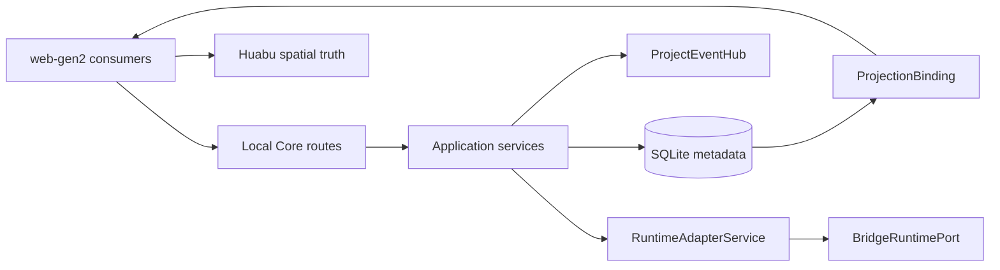

# LCOS Gen2 · T6 · C1-S1
# Current Source Exact Map
## Core / Realtime / Modularity / Migration

**日期：2026-09-07**  
**Current source：`DZWFLi/LCOS_Gen2/main@232b2ca5fbcb3b76b053cf314b5c1193242abb6a`**
**Gen1 reference：`DZWFLi/LCOS-local-creativeOS@f0841587921781bd514edf6acffcbb592e672e52`**  
**Gen1 R3-A historical：`253e98963d5088de930a21943f8a10a28cc8e2d5`**  
**Huabu upstream：`microsoft/Huabu@a3c411e1f655191344285141f08c4738fa6015f7`**  
**性质：Current Source Census；NO PATCH；NO PRODUCT REOPEN；NO NEW STORE / MANAGER / ROUTER**

---

# 0. 当前结论

T6 的 current source 不是“底层全无，需要重写”，而是：

```text
成熟 canonical primitives 已存在
+
若干 production wiring gap
+
Phase-A legacy identity / spatial owner
+
consumer / restart / recovery 证据不均匀
```

主策略候选只能从源码事实导出：

```text
KEEP mature lifecycle / transaction / event primitives
WIRE missing producers and consumers
MIGRATE legacy identity encodings
RETIRE_WRITE spatial second truth
COMPAT_READ during migration
FAIL_CLOSE cross-project / stale / unsupported paths
```

本轮只建账，不冻结修改方案。

---

# 1. 状态词

| 状态 | 含义 |
|---|---|
| `CURRENT_WIRED` | owner、producer、consumer 与持久化/事件链已证明 |
| `CURRENT_CORE_WIRED` | Core 主链已证明，Web 或跨系统 consumer 未完全证明 |
| `CURRENT_SOURCE_PARTIAL` | exact source 存在，但链路仍缺一段 |
| `THIN_GAP` | 成熟 primitive 已有，缺窄 wiring |
| `OWNER_SPLIT` | canonical 与 legacy/derived owner 混在同一模型或写链 |
| `LEGACY_WRITER` | current code 仍写 Phase-A/旧模型字段 |
| `CONSUMER_NOT_PROVEN` | 完整 pinned tree 尚未证明 production consumer |
| `CROSS_THREAD_TO_PIN` | consumer/owner 主要属于另一线程，T6 不越权 |
| `HISTORICAL_ONLY` | 仅作 donor/迁移证据，不是 current truth |
| `TARGETED_PIN_REMAINING` | 不扩大考古，只缺指定 file/symbol/call-path |

---

# 2. 总 owner / data-flow 图



边界：

- SQLite / application services 保存 LCOS canonical truth；
- ProjectEventHub 广播 committed result，不成为第二 truth；
- ProjectionBinding 保存 identity mapping，不保存 geometry/membership；
- Huabu 保存 authoritative geometry / spatial mechanics；
- RuntimeAdapter 隔离 provider，Bridge 不拥有 Canvas geometry。

---

# 3. A · Project Identity / Active Project Routing

## Exact current files / symbols

```text
packages/domain/src/index.ts
  ProjectId
  Project

apps/local-core/src/project-catalog.ts
apps/local-core/src/routes/projects.ts
apps/local-core/src/metadata-repository.ts
  SqliteMetadataRepository.getProject()

apps/web-gen2/src/host/createLcosHostRuntime.ts
  createLcosHostRuntime()
```

## Current behavior

Core 已有真实 Project identity 和 project list/read 路径；Host runtime 支持 retarget/dispose。Current composition 仍存在 sample fallback：

```text
PROJECT_ID ?? 'disposable-mvp-sample'
```

## Census

```text
owner: Core Project / ProjectId
consumer: web-gen2 host runtime
persistence: SQLite projects
mismatch: upstream UI identity wiring still permits sample identity
status: OWNER_SPLIT / LEGACY_WRITER
```

---

# 4. B · Canonical Entity Identity

## Exact current files / symbols

```text
packages/domain/src/index.ts
  Artifact / ArtifactRevision / ArtifactView
  ProjectId / ArtifactId / ArtifactViewId / ArtifactRevisionId
  RelationEntityType

packages/contracts/src/index.ts
  ProjectGraphSnapshot
```

## Current behavior

Artifact、Revision、View 已分离；但 `RelationEntityType` 当前只包含：

```text
artifact | note | scope | view | workspace
```

conversation / skill / run / independent workflow 尚未进入统一 relation endpoint type。

## Census

```text
owner: packages/domain
producer/consumer: Local Core repository + services
persistence: typed tables in SQLite
mismatch: typed identity coverage incomplete for Phase B composition
status: CURRENT_SOURCE_PARTIAL
```

---

# 5. C · Relation / Mutation / ChangeSet Substrate

## Exact current files / symbols

```text
packages/domain/src/index.ts
  Relation
  RelationEntityType

apps/local-core/src/mutation-safety-service.ts
  MutationSafetyService

apps/local-core/src/curation-command-service.ts
  CurationCommandService

apps/local-core/src/routes/relations.ts
apps/local-core/src/routes/entity.ts
```

## Current behavior

MutationSafety / CurationCommand 已提供 transaction、ChangeSet、inverse/revert、CAS/receipt 相关路径。ProjectEvent 只在提交后广播。

## Important boundary

```text
destructive DELETE + inverse ChangeSet
≠
Archive / Restore lifecycle
```

## Census

```text
owner: MutationSafetyService / CurationCommandService
persistence: SQLite ChangeSet / mutation records
realtime: ProjectEventHub after commit
mismatch: relation endpoint vocabulary narrower than Phase B durable composition
status: CURRENT_CORE_WIRED / TYPE_COVERAGE_PARTIAL
```

---

# 6. D · Collection

## Exact current files / symbols

```text
packages/domain/src/index.ts
  ScopeKind = collection
  Scope

apps/local-core/src/presentation-application-service.ts
  PresentationApplicationService

apps/local-core/src/assembly-apply-service.ts
  AssemblyApplyService.#applyToPresentation()
```

## Current behavior

Collection identity/membership 仍横跨 Scope、Presentation memberViewIds/memberEntityRefs 和 Assembly mapping。Presentation membership 有 CAS/ChangeSet 路径，但 Scope 仍承担旧 identity。

## Census

```text
canonical target: durable membership independent from spatial containment
current owner: split across Scope + Presentation
spatial body: Huabu-derived, not membership truth
status: OWNER_SPLIT / LEGACY_WRITER
```

---

# 7. E · Context / ContextSnapshot

## Exact current files / symbols

```text
packages/domain/src/index.ts
  ContextSnapshot

packages/contracts/src/index.ts
  ContextSnapshotRefsV1
  SnapshotCompareResultV1
  BranchSnapshotResultV1

apps/local-core/src/context-snapshot-service.ts
  ContextSnapshotService
  create()
  compare()
  branch()

apps/local-core/src/routes/context-snapshots.ts
```

## Current behavior

Snapshot/history/compare/branch 已有明确 service 和 HTTP boundary。Context 顶层是 active/derived projection，不应倒推成隐藏 canonical membership 容器。

## Census

```text
owner: ContextSnapshotService + SQLite checkpoint/snapshot records
consumer: route/runtime context construction
persistence: SQLite
status: CURRENT_CORE_WIRED
```

---

# 8. F · Workflow

## Exact current files / symbols

```text
packages/domain/src/index.ts
  ScopeKind = workflow

apps/local-core/src/presentation-application-service.ts
  PresentationApplicationService.#validateState()
  workflowActions
  workflowActionEdges

apps/local-core/src/workflow-export-service.ts
apps/local-core/src/routes/workflow.ts
apps/local-core/src/routes/revision-workflows.ts
```

## Current behavior

Workflow action graph 已有 validation、export/import/revision paths，但 identity 仍依附 `Scope(kind=workflow)`，composition 又进入 Presentation state。

## Census

```text
owner: split Scope identity + Presentation composition
persistence: SQLite presentation/scope records
mismatch: independent durable workflow identity not fully normalized
status: OWNER_SPLIT / LEGACY_WRITER
```

---

# 9. G · Workspace / Future Worksite

## Exact current files / symbols

```text
packages/domain/src/index.ts
  Workspace
  WorkspaceViewport
  WorkspaceMembership
  WorkspaceEntityMembership

apps/local-core/src/workspace-state-service.ts
  WorkspaceStateService
  capture()
  restore()

apps/local-core/src/routes/workspace-states.ts
apps/local-core/src/metadata-repository.ts
```

## Current behavior

Workspace 当前同时携带 identity、viewport、scopeId、ArtifactView membership、entity membership。两套 membership API 不对称。

`WorkspaceStateService.save()` 将以下内容写入 Checkpoint snapshot：

```text
workspace.viewport
workspace.focusedViewIds
workspace.visibleLayers
workspace.intent
ArtifactView memberships + optional revisionId
linkedRunIds
```

但 `WorkspaceStateService.restore()` 的 current exact implementation 只执行：

```text
repository.addWorkspaceMembers(
  checkpoint.workspaceId,
  snapshot.memberships.map(artifactViewId),
  'user',
  now,
)
```

它不会恢复：

```text
viewport
focusedViewIds
visibleLayers
intent
workspace_entity_memberships
revision pin
linked runs
```

## Census

```text
owner: SQLite Workspace + membership tables
current semantics: over-broad compared with Phase B Worksite
mismatch: identity / semantic working set / viewport / legacy scope mixed
status: OWNER_SPLIT / LEGACY_WRITER / RECOVERY_PARTIAL_PROVEN
```

---

# 10. H · ProjectionBinding

## Exact current files / symbols

```text
apps/local-core/src/metadata-repository.ts
  ProjectionBindingRecord
  getProjectionBindings()
  findProjectionBinding()
  upsertProjectionBinding()
  deleteProjectionBinding()

apps/web-gen2/src/spatial/projectionBinding.ts
apps/web-gen2/src/spatial/projectToSpaceProjection.ts
apps/web-gen2/src/host/projectionFacade.ts
```

## Current behavior

Key 由 Project + Canvas + SpatialKind + EntityType + EntityId 定位 SpatialId；不保存 geometry。

## Census

```text
owner: Core SQLite identity binding
consumer: web-gen2 projection registry/facade
persistence: projection_binding table
existing primitive: aligned with one authoritative projection per entity/canvas/kind
status: CURRENT_WIRED / KEEP_CANDIDATE
```

---

# 11. I · Projection Reconciliation

## Exact current files / symbols

```text
apps/web-gen2/src/spatial/reconciliationRunner.ts
  ReconciliationRunner

apps/web-gen2/src/spatial/projectToSpaceProjection.ts
apps/web-gen2/src/host/lifecycleReconciler.ts
```

## Current behavior

Current source 从 ProjectGraph artifact census 推导投影。Archive / projection eligibility 未证明成为统一 admission filter。

## Census

```text
producer: Core project graph snapshot
consumer: web-gen2 → Huabu projection
risk: removed UI node can reappear after restart/reconcile
mismatch: eligibility predicate missing/partial
status: THIN_GAP / RECOVERY_RISK
```

---

# 12. J · Archive / Restore / Delete / Remove

## Exact current files / symbols

```text
apps/local-core/src/routes/entity.ts
apps/local-core/src/mutation-safety-service.ts
  MutationSafetyService
apps/local-core/src/curation-command-service.ts
```

## Current behavior

ArtifactView/Note DELETE 是 destructive mutation；ChangeSet inverse 提供撤销能力，但没有证明同一实体进入 archived lifecycle 后可查询、引用和 restore。

Current domain 进一步证明：

```text
packages/domain/src/index.ts
ArtifactAvailability = available | missing | stale
```

没有 `archived` lifecycle state。Current source 中的 `restore_*` 分别用于 relation snapshot、Artifact current revision、Presentation state、ArtifactView/Note delete inverse 和 ResultSlot inverse；它们是 mutation undo/redo vocabulary，不是 canonical Archive/Restore。

## Census

```text
Delete: current destructive path proven
Remove Projection: ProjectionBinding/Huabu concern
Remove Membership: membership concern
Archive/Restore: canonical lifecycle absent at pinned commit
status: CURRENT_DELETE_WIRED / ARCHIVE_MISSING_CURRENT_PRIMITIVE
```

---

# 13. K · ProjectEvent / Replay / Recovery

## Exact current files / symbols

```text
packages/contracts/src/project-events.ts
  ProjectEventReconnectV1
  snapshot_required

apps/local-core/src/project-events/project-event-hub.ts
  ProjectEventHub
  reconnect()

apps/local-core/src/project-events/project-mutation-coordinator.ts
  ProjectMutationCoordinator

apps/local-core/src/routes/project-events.ts
apps/local-core/src/routes/events.ts
```

## Current behavior

```text
runtimeId
projectSeq
2048 retained events
2-minute max retention
replay
snapshot_required
heartbeat
```

Mutation receipt 是 runtime-local、5 分钟、最多 4096；restart 后不构成 exactly-once。

## Recovery model

```text
runtime-local dedupe
+ cursor/runtimeId gap detection
+ authoritative snapshot/refetch
+ reconciliation
```

## Web consumer census

对 `apps/web-gen2/src` 完整文件树检索：

```text
project-events
snapshot_required
runtimeId
projectSeq
EventSource
afterSeq
```

均无 production 命中。Web-gen2 当前 backend client 仅覆盖 projects/artifacts/relations/search 等 typed request；没有统一 ProjectEvent subscriber。

## Census

```text
Core producer/replay: CURRENT_WIRED
unified Web production subscriber: ABSENT_AT_PINNED_COMMIT
specialized consumers: exist, must not be mistaken for unified consumer
status: CURRENT_CORE_WIRED / WEB_CONSUMER_GAP_PROVEN
```

---

# 14. L · ActiveContext

## Exact current files / symbols

```text
packages/contracts/src/index.ts
  ActiveContextV2

apps/local-core/src/active-context-store.ts
  ActiveContextStore
  get()
  update()
  subscribe()
  #emit()

apps/local-core/src/metadata-repository.ts
  getActiveContext()
  saveActiveContext()

apps/local-core/src/routes/canvas.ts
apps/local-core/src/routes/project-events.ts
```

## Producers / consumers

Core producers include Canvas update route and services consuming current attention/context. Known consumers include AttentionRuntimeService、CompanionProjectionService、ContextProposalStore and runtime context construction.

## Test evidence

```text
apps/local-core/tests/active-context-store.test.ts
apps/local-core/tests/local-user-state-persistence.test.ts
apps/local-core/tests/runtime-http.test.ts
apps/local-core/tests/attention-runtime-service.test.ts
```

## Web consumer census

对 `apps/web-gen2/src` 完整树检索以下 ActiveContext contract/fields：

```text
activeContext
active-context
afterVersion
currentSurface
selectedViewIds
pinnedContextIds
```

无 production 命中。因此不是“Core 能力不存在”，而是 Core state/persistence/event 已接通、web-gen2 尚未消费。

## Census

```text
owner: ActiveContextStore
persistence: SQLite projection_json
realtime producer: ProjectEventHub
restart persistence: proven by test
Web production consumer: absent at pinned commit
status: CURRENT_CORE_WIRED / PERSISTENCE_PROVEN / WEB_CONSUMER_GAP_PROVEN
```

---

# 15. M · Presentation

## Exact current files / symbols

```text
packages/contracts/src/presentations.ts
  PresentationStateV0

apps/local-core/src/presentation-application-service.ts
  PresentationApplicationService
  get()
  save()
  #validateState()

apps/local-core/src/presentation-repository.ts
apps/local-core/src/routes/presentations.ts
```

## Current behavior

Presentation 持有有价值的 semantic state，同时仍保存：

```text
positions
hierarchy
colony contour points
spatialRegions.bounds
surfaceElements.bounds
```

## Census

```text
semantic owner: partially valid
geometry owner: conflicts with Huabu authoritative geometry target
persistence: SQLite presentation records with version/CAS
status: OWNER_SPLIT / LEGACY_WRITER
```

---

# 16. N · Colony

## Exact current evidence

```text
packages/contracts/src/presentations.ts
apps/local-core/src/presentation-application-service.ts
Gen1 R3-A @ 253e98963d5088de930a21943f8a10a28cc8e2d5

Gen1 R3-A exact donor:
apps/web/src/state/spatialColony.ts
  SpatialColonyDraft
  colonyContourForMembers()
  colonyFromSelection()
  colonyFromLasso()
  migrateLegacySpatialRegion()
  colonyBounds()
  colonyPathData()
  addMembersToColony()
  rescopeColony()
  reconcileColonyAfterMove()

_HANDOFF/LCOS_v0.15_R3A_CatalogColony_Closeout_20260829.md
scripts/validate-v015-r3a-colony-catalog.mjs
```

## Current behavior

Current Gen2 的 Colony state 主要进入 Presentation；sticky membership、peel/rescope/dissolve 与 contour owner 尚未形成完整独立 canonical chain。

Gen1 R3-A exact donor 已证明：

- selection/lasso 创建候选成员；
- `memberIds` 是 sticky Presentation organization truth；
- 仅穿越 contour 不自动改变 membership；
- decisive separation 通过 `reconcileColonyAfterMove()` + peel threshold 移除成员；
- `rescopeColony()` 重新圈定；
- dissolve 只删除 Colony，不删除成员；
- `migrateLegacySpatialRegion()` 提供旧矩形 region 的一次性迁移入口；
- organic contour 当前确实从 member node geometry 计算，但旧实现把 contour points 持久化进 Presentation。

因此 donor 的交互语义和纯函数可复用，持久化 geometry owner 不可原样继承。Phase B target 应让 contour 从 Huabu member geometry 派生，不升级为长期第二 truth。

## Census

```text
current: PRESENTATION_ENCODED / PARTIAL
historical donor: Gen1 R3-A exact symbols pinned
geometry: Huabu-derived target
status: CURRENT_SOURCE_PARTIAL / HISTORICAL_DONOR_PROVEN
```

---

# 17. O · ResultSlot / Run

## Exact current files / symbols

```text
packages/contracts/src/run-assembly.ts
  resultSlotId

apps/local-core/src/result-slot-service.ts
  ResultSlotService
  create()
  claim()
  markReview()
  materialize()
  release()
  remove()

apps/local-core/src/runtime-application-service.ts
  CreateRuntimeRunInput.resultSlotId
  RuntimeApplicationService.create()

apps/local-core/src/runtime-review-service.ts
  RuntimeReviewService.accept()

apps/local-core/src/metadata-repository.ts
  getRunResultSlotId()
```

## Current producer / consumer

Route 与 create input 接收 `resultSlotId`，但 `RuntimeApplicationService.create()` 尚未证明 persist/claim。`RuntimeReviewService.accept()` 已通过 `getRunResultSlotId()` 消费绑定并 materialize。

完整 pinned tree 中 `markReview()` 直接调用目前只见于：

```text
apps/local-core/tests/assembly-f6-b2.test.ts
apps/local-core/tests/assembly-b6-gapfill.test.ts
```

## Census

```text
lifecycle primitive: proven
accept/materialize consumer: proven
create persist/claim producer: not wired/proven
markReview production caller: CONSUMER_NOT_PROVEN_AT_PINNED_COMMIT
spatial fields: scopeId/workspaceId/x/y/width/height legacy owner mixed in
status: THIN_GAP / OWNER_SPLIT / LEGACY_WRITER
```

---

# 18. P · Assembly

## Exact current files / symbols

```text
packages/contracts/src/assembly.ts
packages/contracts/src/run-assembly.ts

apps/local-core/src/assembly-apply-service.ts
  AssemblyApplyService
  apply()
  #applyToWorkspace()
  #applyToPresentation()
  #applyPlacementOnly()
  #applyConversationContext()

apps/local-core/src/routes/f6-assembly.ts
```

## Current behavior

Good primitive：Assembly 是 router，不成为 truth owner；mutation 委托给 MutationSafety/CurationCommand。

Current debt：

- `main/context/workflow` 仍映射到 Scope；
- Presentation membership 与 geometry placement 在同一 apply path 混写；
- `context/workflow/collection` source 仍统一映射为 scope endpoint；
- conversation relation 支持 view/note/scope/workspace，但受旧 relation vocabulary 限制。

## Census

```text
router-not-owner: KEEP_CANDIDATE
semantic mutation delegation: CURRENT_WIRED
typed target identity: LEGACY_SCOPE_COUPLING
placement: OWNER_SPLIT with Huabu target
status: CURRENT_CORE_WIRED / OWNER_SPLIT / LEGACY_WRITER
```

---

# 19. Q · Railway Durable Order

## Exact current files / symbols

```text
packages/contracts/src/index.ts
  ProjectViewRailKindV0
  ProjectViewRailRefV0
  ProjectViewRailOrderV0

apps/local-core/src/routes/projects.ts
  /projects/:projectId/view-rail-order

apps/local-core/src/metadata-repository.ts
  project view rail order persistence
```

## Census

```text
Core persistence/route: proven
Web/T2 production consumer and CAS behavior: cross-thread pin
T6 scope: durable order storage/ontology compatibility only
status: CURRENT_SOURCE_PARTIAL / CROSS_THREAD_TO_PIN
```

---

# 20. R · Runtime Supplier Boundary

## Exact current files / symbols

```text
apps/local-core/src/runtime-adapter.ts
  BridgeRuntimePort
  RuntimeAdapterService
  dispatch()
  recover()
  materialize()
  bind()

apps/local-core/src/bridge-rest-client.ts
  RestBridgeRuntimeClient implements BridgeRuntimePort

packages/domain/src/index.ts
  RuntimeBinding

apps/local-core/src/metadata-repository.ts
  createRuntimeBinding()
  getRuntimeBinding()
  updateRuntimeBinding()

apps/local-core/src/index.ts
  new RuntimeAdapterService(...)
```

## Current behavior

RuntimeAdapter 已隔离 provider port，并持久化 RuntimeBinding；dispatch/recover 可通过 external task identity 回绑。Supplier selection/configuration 仍在 composition root 注入，LibTV 只能位于 adapter 后方，不能成为 canonical Run owner。

## Census

```text
port: CURRENT_WIRED
binding persistence: CURRENT_WIRED
recovery: current implementation and tests exist
supplier modularity: thin composition seam, not universal provider framework
status: CURRENT_WIRED / KEEP_CANDIDATE
```

---

# 21. S · Huabu Spatial / Storage Mechanics

## Source baseline

```text
microsoft/Huabu@a3c411e1f655191344285141f08c4738fa6015f7
LCOS current vendored baseline: a3c411e1f655191344285141f08c4738fa6015f7
```

## Proven relevant mechanics

```text
RFS execute
executeCanvasCommandsOnHost
server-side canvas execution/persistence
publishCanvasUpdate
SSE /sync/stream
canvasSyncStore
CanvasPage production install
cross-Space move/write coordinator/storage capability in newer upstream
```

## Exact upstream delta

```text
apps/server/src/modules/canvas/space-move.service.ts
  SpaceMoveError
  moveCanvasSelection()
  cloneArtifacts()
  movedWorkloadSpec()

apps/server/src/modules/canvas/space-move-plan.ts
  SpaceMovePlan
  buildSpaceMovePlan()

apps/server/src/modules/canvas/write-coordinator.ts
  withCanvasMutex()
  withCanvasMutexes()
  updateNode()

apps/server/src/modules/storage/ports/contracts/space-write.contract.ts
  SpaceWriteContractHarness
  describeSpaceWriteContract()
```

`moveCanvasSelection()` 已证明的 transaction/recovery pattern：

```text
workspace operation lease
→ stable-order dual Canvas mutex
→ source expectedVersion check
→ plan + artifact clone/ref rewrite
→ reject Agent running / busy / pending changes / missing history
→ destination write without publish
→ Agent thread rehome
→ source deletion write without publish
→ publish destination + source after both succeed
→ reverse source/thread/destination through compensating deltas on failure
→ MOVE_OUTCOME_UNKNOWN when compensation also fails
→ cleanup newly created destination when outcome is known
```

Storage contract tests还证明：

- version conflict 是无副作用 business outcome；
- concurrent same-baseline writes 只能有一个 winner；
- next version 必须等于 expectedVersion + 1；
- node/record/delta 写序和 operational failure 必须满足 contract。

## Census

```text
geometry/spatial mechanics owner: Huabu
RFS live sync: CURRENT_WIRED in audited current chain
cross-space/storage delta: exact upstream files/symbols pinned
canonical LCOS entity/membership owner: MUST NOT move to Huabu
status: CURRENT_WIRED / UPSTREAM_DONOR_PROVEN
```

---

# 22. T · Legacy / Migration Paths

## Table-by-table current writer census

| Table / state | Current fields / writer | Valid truth to keep | Legacy / second truth | C1-S2 migration input |
|---|---|---|---|---|
| `projects` | `SqliteMetadataRepository` project CRUD | stable Project identity | web sample fallback is outside table | wire real ProjectId; retire production fallback |
| `scopes` | `ScopeKind = root/collection/context/workflow/...` | temporary compatibility identity | collection/context/workflow identity overload | compat-read old scope refs; retire new semantic writes after typed identities exist |
| `workspaces` | `save()` / batch mutations write `scope_id`, `intent`, `viewport`, `focused_node_ids`, `visible_layers`, `frame_bounds`, `preferred_surface`, `version` | Worksite identity + selected durable working-set metadata | scope ownership and Core spatial/view state mixed | define slim Worksite fields; migrate/retire spatial writers |
| `workspace_memberships` | `addWorkspaceMembers()` / remove/move paths | ArtifactView working-set membership | separate from entity membership with asymmetric APIs | converge contract without erasing existing membership |
| `workspace_entity_memberships` | entity types `note/scope/workspace/conversation` | non-view working-set membership | `scope` encodes several semantic species | extend typed refs/migrate scope endpoints |
| `artifact_views` | batch `move_artifact_view`, `resize_artifact_view`; repository create/update | projection/reference identity + optional revision pin | `scope_id`, `position`, `size` are legacy spatial ownership | compat-read; stop new authoritative geometry writes; project into Huabu |
| `presentation_views` | `insertPresentationView()` / CAS `updatePresentationView()` | semantic membership, workflow/colony organization, version/CAS | `state_json.positions`, hierarchy/bounds/contour geometry | split semantic state from Huabu-derived geometry; preserve CAS |
| `projection_bindings` | `upsertProjectionBinding()` / `deleteProjectionBinding()` | identity mapping only | none observed; schema explicitly excludes geometry | keep; use as migration bridge |
| `result_slots` | `ResultSlotService` + repository CRUD | lifecycle, claim, Run binding, materialization | `scope_id`, `workspace_id`, `x/y/width/height` | keep lifecycle; retire spatial writes after Huabu placement seam |
| `runs.result_slot_id` | repository run assembly patch / expected create wiring | canonical Run→slot identity | producer wiring incomplete | wire persist+claim transactionally |
| `active_contexts` | `ActiveContextStore.update()` → `saveActiveContext()` | semantic active context/version | viewport-shaped projection fields must not become durable second graph | keep semantic state; define Web subscriber/refetch |
| `project_view_rail_order` | route + repository CAS/version | durable mixed rail order | ontology remains T2-owned | keep persistence; consume T2 typed refs |
| `checkpoints.snapshot_json` | WorkspaceState/ContextSnapshot | immutable historical snapshot | snapshot contains legacy Workspace shape | version migration; do not rewrite old evidence in place |
| `relations` | MutationSafety / CurationCommand | durable typed relation substrate | endpoint vocabulary lacks conversation/skill/run/independent workflow | extend narrowly; migrate scope endpoints only with typed target |
| ProjectEventHub memory | service publish/reconnect | realtime invalidation/replay window | not durable event truth; receipt lost on restart | retain bounded hub; Web snapshot/refetch on gap/runtime change |

## Known direct legacy write symbols

```text
SqliteMetadataRepository.applyBatch()
  move_artifact_view
  resize_artifact_view
  update_workspace_viewport
  update_workspace_presentation
  update_workspace_frame

SqliteMetadataRepository.insertPresentationView()
SqliteMetadataRepository.updatePresentationView()

PresentationApplicationService.save()

WorkspaceStateService.save()
WorkspaceStateService.restore()

ResultSlotService.create()/claim()/markReview()/materialize()/release()/remove()

AssemblyApplyService.#applyToPresentation()
AssemblyApplyService.#applyPlacementOnly()
```

## Census

```text
migration requirement: proven
exact table-by-table current writer map: complete at C1-S1 level
compat-read / retire-write order: C1-S2/C1-S3 responsibility; not invented in source census
status: LEGACY_WRITER_MAP_COMPLETE / MIGRATION_DESIGN_PENDING
```

---

# 23. U · Current Tests / Recovery Evidence

## Proven relevant tests

```text
apps/local-core/tests/project-event-hub.test.ts
apps/local-core/tests/project-mutation-coordinator.test.ts
apps/local-core/tests/events-sse.test.ts
apps/local-core/tests/active-context-store.test.ts
apps/local-core/tests/local-user-state-persistence.test.ts
apps/local-core/tests/runtime-application-service.test.ts
apps/local-core/tests/runtime-review-service.test.ts
apps/local-core/tests/runtime-adapter.test.ts
apps/local-core/tests/runtime-persistence.test.ts
apps/local-core/tests/runtime-result-ingestion.test.ts
apps/local-core/tests/assembly-f6-b2.test.ts
apps/local-core/tests/assembly-b6-gapfill.test.ts
apps/local-core/tests/assembly-apply-f6-b3.test.ts
apps/local-core/tests/assembly-membership-f6-b5.test.ts
apps/local-core/tests/navigation-marker-f6a2.test.ts
```

## Gaps to carry into C1-S2

```text
Archive/Restore lifecycle + restart
projection eligibility + restart/reconcile
unified ProjectEvent Web replay/snapshot recovery
ResultSlot create/claim/markReview production lifecycle
Worksite full-state restart restore
geometry-owner retirement compat-read/retire-write
cross-system partial failure/recovery
browser acceptance for changed visual states
```

## Restart / reconnect evidence matrix

| Capability | Exact test | Evidence | Gap |
|---|---|---|---|
| ProjectEvent replay/gap/runtime restart | `project-event-hub.test.ts` | replay retained suffix; snapshot_required on gap/runtimeId change | no Web production subscriber |
| SSE route | `events-sse.test.ts` | text/event-stream route behavior | browser install absent in web-gen2 |
| ActiveContext | `active-context-store.test.ts`, `local-user-state-persistence.test.ts`, `runtime-http.test.ts` | version/conflict/persistence across Core restart | Web consumer absent |
| Projection lifecycle triggers | `apps/web-gen2/test/g09-host.test.ts` | reconnect immediate; periodic fallback/cooldown | not wired to unified ProjectEvent subscriber |
| ProjectionBinding | `apps/web-gen2/src/backend/sqliteBindingStore.ts` plus spatial tests | durable binding implementation exists | end-to-end restart with Archive eligibility absent |
| ResultSlot | `assembly-f6-b2.test.ts` | create→claim→review→materialize; repository reopen stable | production create/claim/markReview chain absent |
| Assembly scene membership | `assembly-membership-f6-b5.test.ts` | restart persistence + revert | future Worksite and Huabu placement split absent |
| Assembly note membership | `assembly-scene-note-f6-b7.test.ts` | entity membership restart + revert | typed non-Scope composition remains partial |
| Curation receipt | `curation-receipt.test.ts` | operation receipt survives repository restart | distinct from ProjectMutationCoordinator memory receipt |
| Presentation | `presentation-persistence.test.ts` | state and CAS version survive restart | state still contains geometry second truth |
| Railway order | `project-view-rail-order.test.ts` | Core restart persistence | T2 Web consumer/CAS integration pending |
| Runtime Run | `runtime-application-service.test.ts`, `runtime-http.test.ts` | canonical Run/browser recovery | ResultSlot producer gap |
| Runtime review | `runtime-review-service.test.ts` | accept/retry state across restart | markReview production transition absent |
| Runtime binding | `runtime-persistence.test.ts`, `runtime-adapter.test.ts` | binding/recovery behavior | real provider browser E2E not represented here |
| Marker intent | `navigation-marker-f6a2.test.ts` | reload persistence; cross-project fail-close | viewport Pin/Edge Cursor remain derived UI |
| Huabu cross-space | upstream `space-move.service.test.ts`, storage contract/recovery tests | CAS, compensation, failure taxonomy | LCOS semantic participant integration not yet designed |

## Browser evidence verdict

Current Gen2 tree contains Local Core HTTP tests and web-gen2 Node tests, but no LCOS web-gen2 Playwright/browser suite. Huabu has its own `apps/web/playwright.config.ts`; that does not prove LCOS host integration acceptance.

Therefore:

```text
unit/integration/repository restart evidence = PRESENT
web-gen2 host unit evidence = PRESENT
LCOS integrated browser acceptance = NOT_PROVEN_AT_PINNED_COMMIT
```

## Census

```text
unit/integration evidence: broad but uneven
browser/restart matrix: incomplete
status: CURRENT_TESTS_MAPPED / LCOS_BROWSER_ACCEPTANCE_NOT_PROVEN
```

---

# 24. V · Historical-only / Stale Paths

```text
old Engineering Seam Skeleton
  = working hypothesis ledger only

historical RFS manual-refresh failure
  = superseded by CURRENT_WIRED chain

Gen1 R3-A Colony
  = historical donor, not current owner

older 0902/0903 source audits
  = locator/evidence only; current commit wins

Huabu vendored a3c411e1 (aligned in Gen2 main@232b2ca5)
  = implementation baseline/delta base, not latest upstream truth
```

Status：`HISTORICAL_ONLY / DO_NOT_PROMOTE_TO_CURRENT_TRUTH`。

---

# 25. A–V RAG 总表

| 域 | Current owner strength | Persistence | Consumer | 主要 mismatch | 状态 |
|---|---|---|---|---|---|
| A Project identity | 强 | 强 | 部分 | sample fallback | OWNER_SPLIT |
| B Entity identity | 中强 | 强 | 中 | endpoint types incomplete | PARTIAL |
| C Relation/mutation | 强 | 强 | 强 | relation vocabulary narrow | CORE_WIRED |
| D Collection | 分裂 | 中强 | 中 | Scope + Presentation | OWNER_SPLIT |
| E ContextSnapshot | 强 | 强 | 中强 | 无 P0 blocker | CORE_WIRED |
| F Workflow | 分裂 | 强 | 中 | Scope identity + Presentation composition | OWNER_SPLIT |
| G Workspace/Worksite | 分裂 | 强 | 中 | restore only adds ArtifactView members | RECOVERY_PARTIAL_PROVEN |
| H ProjectionBinding | 强 | 强 | 强 | 无 geometry ownership | CURRENT_WIRED |
| I Reconciliation | 中 | n/a | 强 | eligibility missing | THIN_GAP |
| J Lifecycle | Delete 强 / Archive 无 | Delete 强 | 部分 | canonical Archive state absent | MISSING_PRIMITIVE |
| K ProjectEvent | Core 强 | bounded memory | Web 缺失 | unified consumer absent | WEB_GAP_PROVEN |
| L ActiveContext | Core 强 | 强 | Web 缺失 | production Web consumer absent | WEB_GAP_PROVEN |
| M Presentation | 分裂 | 强 | 强 | semantic + geometry mixed | OWNER_SPLIT |
| N Colony | 弱/分裂 | Presentation | 部分 | donor/current gap | PARTIAL |
| O ResultSlot | service 强 | 强 | 部分 | create/markReview wiring + geometry | THIN_GAP |
| P Assembly | router 强 | delegated | 强 | Scope/placement coupling | OWNER_SPLIT |
| Q Railway | Core 中强 | 强 | T2 待钉 | cross-thread consumer | PARTIAL |
| R Runtime supplier | 强 | 强 | 强 | composition seam only | CURRENT_WIRED |
| S Huabu mechanics | 强 | Huabu | 强 | delta pin | WIRED/PIN |
| T Migration | 已识别 | 多表 | 多端 | current writers complete; sequencing pending | MAP_COMPLETE |
| U Tests | 中强 | n/a | n/a | LCOS integrated browser suite absent | TEST_MAP_COMPLETE |
| V Historical | 清楚 | n/a | n/a | promotion risk | CLOSED |

---

# 26. RAG / Agent / Persistence Ownership Matrix（20 rows）

| # | Capability | Exact current owner | Canonical persistence | Producer | Consumer | Derived / cache boundary | Status |
|---:|---|---|---|---|---|---|---|
| 1 | Project file/body discovery | `ProjectRootIndexer` | Artifact/FileRecord SQLite + linked file | import/index/watch | graph/search/context | extracted body可重建 | CURRENT_WIRED |
| 2 | Project lexical search | `ProjectSearchService` | canonical Artifact metadata + derived index | index/watch/mutation | Web search/resource match | ranking/index 可重建 | CURRENT_WIRED |
| 3 | Semantic vector index | `SemanticIndexService` | derived semantic index records | accepted/imported artifacts | search/attention/resource match | vector availability非硬依赖 | DERIVED_WIRED |
| 4 | OCR | `OcrService` | OCR result/cache boundary | image/PDF extraction request | search/context/resource | output可按 source hash/version 重建 | CURRENT_CORE_WIRED |
| 5 | Search body normalization | `search-artifact-body.ts` | none independently | Artifact/revision reader | lexical/semantic index | pure derived materialization | CURRENT_WIRED |
| 6 | Format coverage | `search-format-coverage.ts` | none | MIME/extension census | search/resource import | unsupported archive 不扁平索引 | CURRENT_WIRED |
| 7 | Active semantic context | `ActiveContextStore` | `active_contexts.projection_json` | Canvas route/user/context proposal | attention/runtime/companion | recent graph projection 可重算 | CORE_WIRED / WEB_GAP |
| 8 | Stable ContextSnapshot | `ContextSnapshotService` | checkpoint/context snapshot SQLite | explicit capture/branch | runtime/context UI | immutable snapshot，不是 live state | CURRENT_WIRED |
| 9 | Context manifest | `ContextManifestService` | context manifest SQLite | RuntimeApplication create | RuntimeAdapter materialize | source pack可由 refs 重建但 manifest 是 Run evidence | CURRENT_WIRED |
| 10 | Context prompt/cache plan | `context-prompt-serializer.ts` + contracts | Runtime input pack / cache telemetry as configured | runtime materialization | provider adapter | cache partitions不能升级为 truth | CURRENT_WIRED |
| 11 | Attention/work-state projection | `AttentionRuntimeService` | canonical inputs elsewhere | ActiveContext + project state | companion/agent UX | projection/inference derived | CURRENT_CORE_WIRED |
| 12 | Context change proposal | `ContextProposalStore` | proposal SQLite | Codex/agent proposal | review/accept route | proposal 不直接改 ActiveContext | CURRENT_WIRED |
| 13 | Skill proposal | `SkillProposalService` | proposal SQLite | agent/skill workflow | shared proposal review consumer | proposal 不等于 installed capability | CURRENT_WIRED |
| 14 | Run proposal/plan | `RuntimeProposalService` + contracts | proposal payload/Run only when accepted | Composer/agent plan route | RuntimeApplicationService | plan 不是 canonical Run | CURRENT_WIRED |
| 15 | Canonical Run lifecycle | `RuntimeApplicationService` + repository | `runs`, events, dispatch | HTTP create/action | Web/runtime/review | provider state经 adapter映射 | CURRENT_WIRED_WITH_SLOT_GAP |
| 16 | Provider boundary | `RuntimeAdapterService` / `BridgeRuntimePort` | RuntimeDispatch + RuntimeBinding | Run dispatch/recover | Bridge provider | provider envelope/evidence不取代 Run truth | CURRENT_WIRED |
| 17 | Provider result ingestion | `RuntimeResultIngestionService` | ArtifactReturn/Draft/ChangedFile/evidence archive | Bridge result envelope | RuntimeReviewService | raw evidence archive不是 Current artifact | CURRENT_WIRED |
| 18 | Human review/accept | `RuntimeReviewService` | Run/ArtifactReturn/Revision/ChangeSet | review routes | canonical artifact + ResultSlot | accept前保持 Draft/Pending | CURRENT_WIRED_WITH_SLOT_GAP |
| 19 | Result placement lifecycle | `ResultSlotService` | `result_slots` + `runs.result_slot_id` | Run create应 claim；review应 markReview | accept/materialize | x/y/size 是待退休 spatial second truth | THIN_GAP / OWNER_SPLIT |
| 20 | Agentlet/companion projection | `AgentletRuntimeService` / `CompanionProjectionService` | Agentlet Run/canonical Run inputs | runtime + ActiveContext + provider status | companion UI/agent UX | projection可重建，不另建 agent truth | CURRENT_CORE_WIRED |

## Matrix boundary conclusions

```text
Canonical:
Project / Artifact / Revision / Run / RuntimeBinding / ContextSnapshot / accepted proposal state

Durable but derived/rebuildable:
search index / vector index / OCR cache / attention projection / companion projection

Ephemeral:
ProjectEvent replay buffer / ProjectMutationCoordinator short receipt / browser viewport affordance

Human gate:
proposal accept / Artifact Return accept / conflict waiting_input
```

No current source evidence supports creating a second RAG database as canonical Project truth or allowing Agent/Bridge/provider state to overwrite accepted Artifact current state silently.

---

# 27. Architecture Conflict Gate

目前没有发现必须回报 Coordinator 的不可薄适配冲突。

已发现的问题均可先进入 C1-S2 seam 候选：

```text
WIRE
MIGRATE
COMPAT_READ
RETIRE_WRITE
WRAP existing primitive
ADD narrow eligibility / lifecycle field or route only after formal card
```

禁止由本地图直接推出：

```text
ArchiveServiceV2
new global EventBus
new Project Manager
second canonical geometry store
universal provider framework
parallel workflow/collection database
```

---

# 28. C1-S1 Exit Gate

## 已通过

- [x] A–V 全职责域已铺开；
- [x] current / historical / donor / target 已分层；
- [x] Core / Huabu / Bridge owner 边界明确；
- [x] Delete 与 Archive 未混写；
- [x] ResultSlot lifecycle 与 wiring gap 分开；
- [x] ProjectEvent receipt 与 cross-restart recovery 分开；
- [x] Railway 跨线程边界明确；
- [x] 未写 production patch；
- [x] 未重开 Phase B 产品语义。

## 已闭合或明确移交下一阶段

- [x] ProjectEvent unified Web production consumer 的最终 census；
- [x] ActiveContext Web producer/consumer exact chain；
- [x] Archive/Restore current absence 与现有 restore vocabulary 边界；
- [x] WorkspaceState restore 的逐字段实现矩阵；
- [x] Archive/Restore 的 target insertion seam 明确移交 C1-S2；S1 不发明 patch；
- [x] Worksite future restore 的 restart acceptance 明确移交正式施工卡；
- [x] Gen1 R3-A Colony 必要 donor symbol；
- [x] Huabu cross-space/write-coordinator/storage contract exact delta；
- [x] table-by-table current legacy writer / keep / migration-input matrix；
- [x] 20-row RAG / Agent / Persistence responsibility matrix；
- [x] T2 Railway 明确保持 `CROSS_THREAD_TO_PIN`；不作为 T6 C1-S1 blocker。

当前文档状态：

```text
FINAL CURRENT SOURCE MAP
A–V COVERAGE COMPLETE
P0 SOURCE PIN COMPLETE
C1-S1 CLOSED
```

---

# 29. 下一步

下一轮只允许从本地图收 seam，不再回到 broad census：

```text
1. Project identity + projection eligibility + Archive/Restore
2. ProjectEvent Web subscriber + snapshot/refetch/reconcile
3. typed Relation + Collection membership + Workflow composition
4. Workspace → Worksite + restore convergence
5. Presentation / ResultSlot / ArtifactView geometry retirement
6. Assembly typed targets + semantic/spatial split
7. Runtime supplier thin seam
```

通过后才进入：

```text
T6 C1-S2 · Source Engineering Seam Skeleton
```
