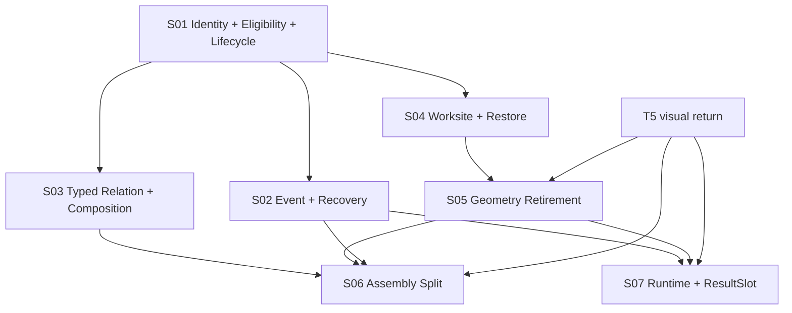

# LCOS Gen2 · T6 · C1-S2
# Source Engineering Seam Skeleton
## Core / Realtime / Modularity / Migration

**日期：2026-09-07**  
**上游：`LCOS_Gen2_T6_C1-S1_Current_Source_Exact_Map_20260907.md`**  
**Current source：`DZWFLi/LCOS_Gen2/main@232b2ca5fbcb3b76b053cf314b5c1193242abb6a`；Huabu upstream `a3c411e1f655191344285141f08c4738fa6015f7`**
**性质：Engineering seam freeze；NO PATCH；NO PRODUCT REOPEN；NO FINAL VISUAL LOCK**

---

# 0. 结论

C1-S1 的 22 个职责域收束为 7 组施工 seam：

```text
S01 Project Identity
    + Projection Eligibility
    + Archive / Restore

S02 ProjectEvent Web Recovery
    + Snapshot / Refetch / Reconcile

S03 Typed Relation
    + Collection Membership
    + Workflow Composition

S04 Workspace → Worksite
    + Durable Working Set
    + Restore Convergence

S05 Geometry Truth Retirement
    + Presentation / ArtifactView / ResultSlot

S06 Assembly Typed Targets
    + Semantic / Spatial Split

S07 Runtime Supplier Boundary
    + ResultSlot Run Wiring
```

这 7 组按 transaction、recovery 和 migration coupling 聚类，不按 UI 页面拆分。

---

# 1. 总依赖图



推荐施工顺序：

```text
S01 → S02 → S03 → S04 → S05 → S06 → S07
```

其中 S03 与 S04 可在 S01 contract 冻结后并行规划；S05 需要 T5 回灌最终 body/LOD/motion，但 geometry owner retirement 本身不等待 T5。

---

# 2. 统一 seam 规则

每条 seam 必须服从：

1. Core canonical commit 成功后才发布 ProjectEvent；
2. ProjectEvent 只做 invalidation/recovery signal，不保存第二 truth；
3. Huabu geometry/spatial write 与 Core semantic write 分 participant；
4. 跨 participant 失败必须进入可观察 recovery，不静默半成功；
5. migration 使用 `compat-read → migrate/backfill → retire-write → observe → retire-read`；
6. AI 结果在人工 accept 前保持 Draft/Pending；
7. cross-project、stale version、unknown identity 必须 fail-close；
8. 不把 donor 的数据 owner 一起搬进 LCOS；
9. 不新增通用 Manager/EventBus/Provider framework；
10. C1-S3 每卡只解决 1–2 条强耦合 seam。

---

# 3. S01 · Project Identity + Projection Eligibility + Archive/Restore

## 3.1 为什么是一组

Archive 是否在 Canvas 出现，取决于 canonical lifecycle；restart 后是否复活，取决于 reconciliation eligibility；所有查询必须先绑定真实 ProjectId。因此三者共享同一 recovery chain：

```text
Project identity
→ canonical lifecycle
→ projection eligibility
→ reconciliation source census
→ ProjectionBinding
→ Huabu projection
```

## 3.2 Existing owners

```text
packages/domain/src/index.ts
  ProjectId / Project / Artifact / ArtifactAvailability

apps/local-core/src/project-catalog.ts
apps/local-core/src/routes/projects.ts
apps/local-core/src/metadata-repository.ts

apps/web-gen2/src/host/createLcosHostRuntime.ts
apps/web-gen2/src/spatial/reconciliationRunner.ts
apps/web-gen2/src/spatial/projectToSpaceProjection.ts
apps/web-gen2/src/spatial/projectionBinding.ts
```

## 3.3 Adopt / Wrap / Migrate / Retire

```text
KEEP
  Core Project identity
  Host runtime retarget/dispose
  ProjectionBinding identity-only schema
  Reconciliation as projection repair owner

ADD_THIN
  canonical lifecycle state for archivable entities
  one eligibility predicate consumed by initial projection and reconciliation
  Archive/Restore mutation commands using existing transaction/ChangeSet/Event path

WIRE
  real active ProjectId into host composition
  lifecycle mutation success → reconcile/invalidate

RETIRE
  production sample ProjectId fallback
  UI-only hide/delete pretending to be Archive
```

## 3.4 Target data flow

```text
Archive request
→ validate Project + Entity identity
→ preview affected projections/references
→ canonical transaction commits archived state + ChangeSet
→ artifact/entity changed event
→ Web refetches authoritative state
→ eligibility returns false for authoritative projection
→ reconciliation removes projection/binding as required
→ archived reference remains possible only through explicit reference policy
```

Restore reverses canonical lifecycle first, then lets eligibility/reconciliation reconstruct projection; it must not resurrect old Core geometry.

## 3.5 Failure / recovery

- stale lifecycle version: reject with conflict;
- Core commit fails: no event/no Huabu mutation;
- Core succeeds, Web disconnects: reconnect → replay or snapshot_required → refetch → reconcile;
- Huabu removal fails: canonical archive remains truth; projection enters repair-needed, never rolls canonical state back silently;
- unknown ProjectId: fail-close before runtime/reconcile.

## 3.6 Migration

```text
current availability = available/missing/stale
```

不能把 `missing` 偷换成 archived。C1-S3 必须决定独立 lifecycle 字段/表的最薄落点，并提供旧行默认 active 的 migration fixture。

## 3.7 T5 input/output

T5 已可依赖四个不同动作：Remove Projection、Remove Membership、Archive、Delete。T5 需回传 archived、archived-reference、restore、projection-removal 的最终视觉与动效；不得要求保留旧 x/y 作为 restore truth。

## 3.8 Blast radius

```text
domain type
SQLite schema/migration
entity routes/mutation service
project graph/read/search/context filters
reconciliation
web event/refetch
tests + browser restart acceptance
```

---

# 4. S02 · ProjectEvent Web Recovery + Snapshot/Refetch/Reconcile

## 4.1 Existing owners

```text
packages/contracts/src/project-events.ts
apps/local-core/src/project-events/project-event-hub.ts
  ProjectEventHub.reconnect()
apps/local-core/src/project-events/project-mutation-coordinator.ts
apps/local-core/src/routes/project-events.ts
apps/local-core/src/routes/events.ts

apps/web-gen2/src/host/lifecycleReconciler.ts
apps/web-gen2/src/host/projectionFacade.ts
```

## 4.2 Current gap

Core replay/snapshot_required 已成熟；web-gen2 pinned tree 没有统一 EventSource subscriber，也没有 ActiveContext subscriber。LifecycleReconciler 有 reconnect trigger，但没有连接到 Core ProjectEvent stream。

## 4.3 Seam shape

```text
REUSE
  ProjectEventHub
  runtimeId/projectSeq cursor
  replay/snapshot_required
  HostLifecycleReconciler cooldown/dedupe

ADD_THIN
  one typed web ProjectEvent client/subscriber
  one per-project cursor state
  event-kind → query invalidation/refetch/reconcile routing table

DO_NOT_ADD
  second EventBus
  durable browser event log
  optimistic canonical event reducer
```

## 4.4 Recovery algorithm

```text
connect(projectId, runtimeId?, afterSeq?)
→ replay
   → process in projectSeq order
   → update cursor only after consumer accepts invalidation

→ snapshot_required
   → discard assumptions tied to old runtime/cursor
   → authoritative refetch by affected domains
   → ProjectionBinding reload
   → reconciliation
   → store new runtimeId/currentSeq
```

Events trigger refetch; they do not directly mutate canonical UI stores with payload guesses.

## 4.5 Event routing families

```text
artifact/relation/presentation/workspace changed
  → invalidate relevant query
  → reconcile if projection eligibility/body may change

active-context changed
  → refetch ActiveContext
  → update derived attention/selection consumers

run/result/proposal changed
  → refetch execution/review projections

unknown event kind
  → conservative project snapshot/refetch, not silent ignore
```

## 4.6 Failure / recovery

- duplicate event: idempotent invalidation;
- gap/retention loss/runtime restart: snapshot_required;
- malformed payload: do not advance semantic consumer state; fallback refetch;
- offline: reconnect with last acknowledged cursor;
- rapid mutations: debounce/batch refetch, but preserve cursor order;
- listener exception: must not affect committed Core mutation.

## 4.7 Blast radius

```text
web-gen2 backend client
host runtime lifecycle
query caches/stores
projection reconciliation
ActiveContext consumer
SSE integration tests
browser disconnect/restart acceptance
```

---

# 5. S03 · Typed Relation + Collection Membership + Workflow Composition

## 5.1 Why grouped

三者共享 durable composition、typed endpoint、transaction/Undo/CAS substrate。若分开施工，会重复造 membership 表或让 Workflow/Collection 继续借 Scope 互相冒充。

## 5.2 Existing owners

```text
packages/domain/src/index.ts
  Relation / RelationEntityType / Scope / ScopeKind

packages/contracts/src/presentations.ts

apps/local-core/src/mutation-safety-service.ts
apps/local-core/src/curation-command-service.ts
apps/local-core/src/presentation-application-service.ts
apps/local-core/src/workflow-export-service.ts
apps/local-core/src/routes/relations.ts
apps/local-core/src/routes/workflow.ts
```

## 5.3 Seam shape

```text
KEEP
  Relation + transaction + ChangeSet/inverse
  Presentation CAS
  Workflow action validation/export

LIFT / EXTEND_NARROWLY
  typed EntityRef endpoint vocabulary
  durable Collection membership
  durable Workflow composition

MIGRATE
  Scope(kind=collection/workflow) identity refs
  Presentation membership that currently acts as canonical composition

RETIRE_WRITE
  new composition writes expressed only as Scope or spatial containment
```

## 5.4 Identity rule

```text
Canonical Entity
≠ Membership / Composition
≠ ProjectionBinding
≠ Spatial Body
```

An object lying inside a Collection/Colony contour is not automatically a durable member. Workflow re-layout must not change composition.

## 5.5 Mutation flow

```text
typed membership/composition command
→ validate endpoint existence + same Project
→ validate containment/cycle/cardinality rules
→ one canonical transaction
→ ChangeSet + inverse
→ ProjectEvent after commit
→ presentation/projection refetch
```

## 5.6 Compatibility

Read old Scope/Presentation encodings into typed compatibility projections; new writers use one canonical typed substrate after migration gate. Do not dual-write indefinitely.

## 5.7 Failure / recovery

- duplicate add: idempotent no-op/receipt;
- cycle or cross-project endpoint: fail-close;
- stale Presentation CAS: conflict/retry once only where safe;
- restart: membership/composition and ChangeSet survive;
- legacy reference not resolvable: expose migration issue, do not invent entity.

## 5.8 Cross-thread/T5

T1/T3 consume interaction semantics; T5 owns final body. T6 owns durable state and migration only. Collection/Colony visual similarity must never collapse their truth distinction.

---

# 6. S04 · Workspace → Worksite + Working Set + Restore

## 6.1 Existing owners

```text
packages/domain/src/index.ts
  Workspace
  WorkspaceMembership
  WorkspaceEntityMembership

apps/local-core/src/workspace-state-service.ts
  save()
  restore()

apps/local-core/src/metadata-repository.ts
  workspaces
  workspace_memberships
  workspace_entity_memberships
```

## 6.2 Current mismatch

Workspace 把 identity、scopeId、viewport、focus/layers、working-set membership 和 frame bounds 混在一起。`restore()` 只 add ArtifactView memberships，未恢复 snapshot 中多数状态。

## 6.3 Seam shape

```text
KEEP
  durable workspace/worksite identity
  ArtifactView and typed entity working-set membership
  Checkpoint snapshot history

SLIM / MIGRATE
  Workspace → Worksite domain naming/contract
  scopeId legacy dependency
  dual membership APIs toward one typed contract

MOVE_OWNER
  authoritative viewport/geometry to Huabu

FIX_RECOVERY
  define exactly which semantic fields restore
  return explicit restore outcome instead of pretending full restore
```

## 6.4 Target recovery split

```text
Worksite semantic restore
  identity / working set / intent / durable focus policy

Huabu spatial restore
  canvas viewport / node geometry / spatial state

Checkpoint
  immutable reference to both versioned snapshots
```

No service may silently restore only memberships while returning the full saved snapshot as if applied.

## 6.5 Migration

Old Workspace rows remain readable. C1-S3 must define schemaVersion and one-way migration/backfill, keeping old Checkpoints immutable and version-decoded.

## 6.6 Failure / recovery

- missing member: mark partial/stale and report;
- spatial restore unavailable: semantic Worksite still loads, spatial recovery flagged;
- cross-project member: reject;
- concurrent membership mutation: transactional/CAS path;
- restart: identity + working set must recover without relying on browser local state.

---

# 7. S05 · Geometry Truth Retirement

## 7.1 Legacy owners

```text
artifact_views.position / size
workspaces.viewport / frame_bounds
presentation_views.state_json.positions
presentation hierarchy/bounds/contour geometry
result_slots.x/y/width/height + workspaceId/scopeId
```

## 7.2 Target owner

```text
Huabu = authoritative geometry / viewport / spatial mechanics
Core = canonical entity / semantic state / projection identity
ProjectionBinding = mapping only
```

## 7.3 Seam shape

```text
COMPAT_READ
  legacy geometry for initial migration/bootstrap only

BACKFILL
  materialize Huabu spatial nodes once with provenance/version marker

RETIRE_WRITE
  Core move/resize/placement writers after cutover

KEEP
  semantic Presentation state
  ResultSlot lifecycle
  ArtifactView revision/reference identity

DO_NOT_DELETE_EARLY
  legacy columns/state until observation window and rollback gate pass
```

## 7.4 Migration state machine

```text
legacy-only
→ migrated-to-Huabu
→ Huabu-authoritative + Core compat-read
→ Core geometry retire-write
→ observation window
→ optional retire-read/schema cleanup
```

Each entity requires migration idempotency and a detectable source version/hash; “if Huabu node missing, copy old coordinates again” cannot run forever because it can resurrect intentionally removed projections.

## 7.5 Failure / rollback

- backfill fails: remain legacy-readable, no partial authority flip;
- Huabu write succeeds/Core marker fails: reconcile by deterministic binding/version;
- Core marker succeeds/Huabu missing: repair-needed, do not accept new Core geometry writes;
- rollback before retire-read: re-enable legacy writer only through explicit release rollback, not runtime dual-write.

## 7.6 T5 dependency

T5 supplies final body, LOD, transition and restore motion. T5 does not decide where geometry persists. Visual rollback must not imply data-owner rollback.

---

# 8. S06 · Assembly Typed Targets + Semantic/Spatial Split

## 8.1 Existing owner

```text
apps/local-core/src/assembly-apply-service.ts
  AssemblyApplyService
  #applyToWorkspace()
  #applyToPresentation()
  #applyPlacementOnly()
  #applyConversationContext()

apps/local-core/src/routes/f6-assembly.ts
packages/contracts/src/assembly.ts
packages/contracts/src/run-assembly.ts
```

## 8.2 Keep

Assembly remains router-not-owner. It delegates semantic mutations to MutationSafety/CurationCommand and must not acquire its own membership database.

## 8.3 Migrate

```text
main/context/workflow → Scope lookup
collection/context/workflow source → scope relation endpoint
semantic membership + Presentation position in one apply
```

to:

```text
typed canonical target resolution
→ semantic mutation transaction
→ committed result/event
→ optional Huabu placement participant
```

## 8.4 Target flow

```text
Assembly proposal
→ resolve typed source/target in same Project
→ preview semantic change + spatial effect separately
→ commit semantic change
→ publish event
→ apply/confirm Huabu placement
→ return compound outcome
```

Compound outcome must distinguish:

```text
semantic_applied + placement_applied
semantic_applied + placement_pending_repair
semantic_rejected
outcome_unknown
```

## 8.5 Donor pattern

Huabu `moveCanvasSelection()` demonstrates stable-order locks, destination-first unpublished write, source write, publish-after-success, compensation and outcome-unknown taxonomy. LCOS may adopt the recovery pattern, not Huabu's Canvas as semantic membership owner.

## 8.6 Failure / idempotency

- operationId identifies semantic mutation;
- placement retry must not duplicate membership;
- stale target version rejects before semantic mutation where possible;
- cross-project target fails closed;
- compensation failure is explicit outcome_unknown/waiting_input;
- already-member can still request placement without generating a fake semantic ChangeSet.

---

# 9. S07 · Runtime Supplier Boundary + ResultSlot Wiring

## 9.1 Existing owners

```text
apps/local-core/src/runtime-adapter.ts
  BridgeRuntimePort
  RuntimeAdapterService
  dispatch()/recover()/materialize()/bind()

apps/local-core/src/bridge-rest-client.ts
  RestBridgeRuntimeClient

apps/local-core/src/runtime-application-service.ts
  RuntimeApplicationService.create()

apps/local-core/src/runtime-review-service.ts
  RuntimeReviewService.accept()

apps/local-core/src/result-slot-service.ts
  ResultSlotService
```

## 9.2 Seam shape

```text
KEEP
  BridgeRuntimePort
  RuntimeAdapterService
  RuntimeBinding persistence/recovery
  ResultSlot lifecycle

WIRE
  Run create + resultSlotId persist + claim
  transition to review + ResultSlot.markReview
  accept + materialize (already partially wired)

WRAP
  alternative supplier/LibTV behind existing port only

RETIRE_WRITE
  ResultSlot Core geometry after S05 cutover
```

## 9.3 Transaction/event order

```text
validate slot belongs to same Project and is empty/compatible
→ create canonical Run with result_slot_id
→ claim slot for Run in same transaction boundary or recoverable operation
→ dispatch through RuntimeAdapter
→ provider result ingestion creates Draft/Pending Return
→ Run enters review
→ markReview(slot, run)
→ human accept
→ materialize accepted Artifact/View identity into slot
→ placement handled through Huabu seam
```

## 9.4 Recovery

- create Run succeeds, claim fails: Run cannot dispatch as healthy; retry/reconcile binding;
- dispatch fails: Run/slot remains recoverable, not orphaned running;
- restart: RuntimeBinding and slot binding reload from SQLite;
- late result after cancel: evidence archive only, no Draft materialization;
- accept succeeds, placement fails: canonical artifact accepted; spatial repair explicit;
- `markReview()` duplicate same Run: idempotent; cross-Run conflict rejected.

## 9.5 Supplier boundary

Supplier selection is a composition concern. No supplier may receive direct repository/Canvas ownership. LibTV or another donor must implement/wrap `BridgeRuntimePort` and return the same typed task/result identity used by RuntimeBinding.

---

# 10. Cross-seam event order

```text
1. validate identity/version/permission
2. write canonical semantic state
3. persist ChangeSet/receipt where applicable
4. commit transaction
5. publish ProjectEvent
6. Web invalidates/refetches authoritative state
7. reconcile projection eligibility/binding
8. apply or repair Huabu spatial state
9. update derived search/context/attention materializations
```

Exception：跨 Core/Huabu compound operations may need prepare/compensation, but neither side may publish a final-success visual state before the outcome is known.

---

# 11. Migration waves

```text
Wave 0  Observability + fixtures
Wave 1  Project identity + lifecycle + eligibility
Wave 2  Event subscriber + recovery
Wave 3  Typed composition substrate
Wave 4  Worksite convergence
Wave 5  Geometry backfill + retire-write
Wave 6  Assembly split
Wave 7  ResultSlot wiring + supplier polish
Wave 8  remove compatibility reads only after acceptance window
```

Each wave must be independently revertable until destructive schema cleanup. No wave deletes old columns in the same release that first stops writing them.

---

# 12. C1-S3 candidate cards

| Card | Seams | Expected depth |
|---|---|---|
| C1-1 | Project Identity + Projection Eligibility + Archive/Restore | schema, mutation, event, restart/reconcile |
| C1-2 | ProjectEvent Web Subscriber + ActiveContext Recovery | SSE client, cursor, refetch, snapshot, browser offline |
| C1-3 | Typed Relation + Collection Membership | endpoint types, transaction, migration, Undo |
| C1-4 | Workflow Composition | identity, action graph, export/import, migration |
| C1-5 | Workspace → Worksite + Restore | slim schema, memberships, checkpoint/version restore |
| C1-6 | Geometry Truth Retirement | ArtifactView/Presentation/ResultSlot backfill and retire-write |
| C1-7 | Assembly Typed Targets + Compound Outcome | router, semantic commit, Huabu placement/recovery |
| C1-8 | Runtime Supplier + ResultSlot Lifecycle Wiring | create/claim/review/materialize/restart/provider |

Card order may merge C1-3/C1-4 if exact transaction owner is identical; otherwise keep them separate. Do not combine C1-6 and C1-7 into one oversized migration card.

---

# 13. Cross-thread contract

```text
T1
  consumes Collection/Colony/Workflow/Archive truth and eligibility

T2
  owns Railway Web consumer/final ontology; T6 owns persistence compatibility

T3
  consumes event/refetch and typed interaction targets

T4
  consumes Worksite/window/Assembly environment; does not own persistence

T5
  owns final morphology/motion/LOD; does not own canonical state

T6
  owns canonical persistence, migration, realtime/recovery and runtime seams
```

---

# 14. C1-S2 exit gate

- [x] All S1 gaps assigned to one seam family;
- [x] Existing owners retained where mature;
- [x] Core/Huabu/Bridge boundaries explicit;
- [x] semantic mutation and spatial placement separated;
- [x] event/recovery order explicit;
- [x] migration uses compat-read/retire-write stages;
- [x] no product semantic reopened;
- [x] no new broad framework invented;
- [x] cross-thread dependencies marked;
- [x] candidate exact-source cards defined;
- [ ] T5 final visual return consumed in C1-S3 visual acceptance sections;
- [ ] exact ADD/MODIFY/KEEP/RETIRE file matrices written per C1-S3 card.

The last two items are downstream gates, not blockers for C1-S2 closure.

Current status：

```text
C1-S2 ENGINEERING SEAM SKELETON COMPLETE
C1-S3 READY TO START
PRODUCTION PATCH NOT AUTHORIZED
```
