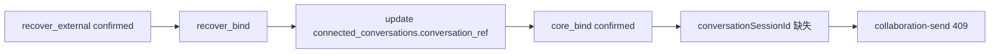
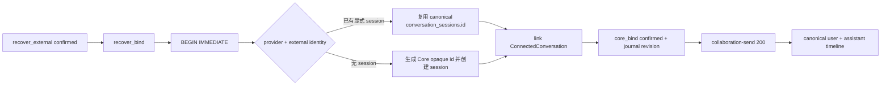

# GEN2 Canonical Conversation Session Link · Real ACP Fixture

日期：2026-09-20  
基线：`frontend-reconstruction-v2@b31c5f5`  
Worktree：`E:\OS开发\LCOS_GEN2\.worktrees\canonical-session-bind`  
范围：T6 `recover_bind` → Core canonical `conversation_sessions` link  
提交：本地提交，未 push

## 结论

已修复真实 ACP fixture 的唯一 blocker：`confirmContinuationCoreBind()` 现在在同一个 SQLite `BEGIN IMMEDIATE` 事务内创建或复用 Core-owned `conversation_sessions`，把它链接到 `ConnectedConversation`，再确认 continuation journal 的 `core_bind`。真实 `collaboration-send` 已从 409 变为 200，并把 fixture assistant text 写入 canonical timeline；重启 Core 后 session 与 timeline 仍可读。

## 变更前后流程





## 用户操作与数据流

用户仍从既有 continuation recovery 入口执行 `recover_external`、`recover_bind`，随后发送一条 collaboration prompt。外部 provider 的 `externalSessionId` 只作为明确的 provider identity 证据；Core session id 由 Core 生成的 opaque UUID 负责，不把 provider session identity 猜成 Core conversation id。

同一 `provider + externalSessionId` 的重复绑定复用已有 canonical session。相同 provider identity 已属于另一个 project、一个 provider identity 已绑定另一条同项目 ConnectedConversation、session 被其他 ConnectedConversation 占用、或 identity 映射出现多行时，事务 fail-close 并整体回滚。不同 provider 的同名外部字符串保持命名空间隔离。

## 修改文件

- `apps/local-core/src/metadata-repository.ts`：扩展 `confirmContinuationCoreBind()`；原子创建/复用 canonical session、建立 `conversation_session_id` 链接、校验 project/provider/identity 冲突。
- `apps/local-core/tests/continuation-recovery-action.test.ts`：验证 recover bind 创建 Core-owned session，随后同一 provider identity 复用同一 session。

没有新增 schema 或第二套 Conversation truth。已有 `conversation_sessions`、`conversation_messages`、`ConversationImportService` 读取路径继续作为 canonical timeline owner；empty recovery session 只提供可追加的 canonical session 行。

## 验证结果

单元 / 集成：

```text
npx vitest run apps/local-core/tests/continuation-recovery-action.test.ts apps/local-core/tests/collaboration-send.test.ts --maxWorkers=1
2 files / 29 tests PASS

npm run typecheck --workspace @local-creative-os/local-core
PASS

npm run build --workspace @local-creative-os/local-core
PASS

git diff --check
PASS
```

真实 ACP fixture（隔离端口 Core `43141`、Huabu Host `3021`、worktree 独立 DB）：

```text
recover_external                 200 / external_create=confirmed
recover_bind                     200 / core_bind=confirmed / conversationSessionId=conversation-<Core UUID>
collaboration-send               200 / assistant="fixture continued"
collaboration-timeline           user_message + agent_message
Core restart + reload read       collaboration session 200 / canSend=true；timeline 两条消息仍在
重复 recover_bind                409 action not allowed；canonical session id 未新增
```

证据日志目录：`.tmp/real-fixture/logs/`。该目录为本地生成数据，不纳入提交。

## 验收条件

- `ConnectedConversation.conversationSessionId` 在真实 `recover_bind` 后明确存在。
- `conversationSessionId` 不等于 provider `externalSessionId`。
- `collaboration-send` 能返回真实 fixture assistant text，并写入 canonical message rows 与 timeline projection。
- Core 重启后 identity/session/timeline 可读。
- 重复 provider identity 不创建第二个 canonical session。
- cross-project / cross-identity 冲突 fail-close；事务失败不留下 connected 或 journal 半状态。

## 风险、成本与回滚

成本是一次事务内增加一次 canonical session identity lookup 与最多一行 session insert；没有 schema migration。风险是历史手工绑定 session 若已有显式 identity metadata 与本次 provider identity 不一致会拒绝恢复，避免静默换绑。

回滚使用审查后的 `git revert <local-commit>`，不使用 reset，不覆盖工作区其它未提交 patch。回滚后真实 ACP 链会恢复到原 blocker：`recover_bind` 可确认但 collaboration-send 因缺失 canonical session 返回 409。

未完成：生产 Codex/Claude provider 未在本 fixture 中验证；waiting_input、review、artifact return 仍不属于本次 scope。
