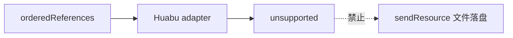
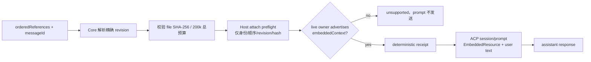

# GEN2 Continuation Provider AttachContext 施工交付

## 结论

Huabu 没有现成的“把资源绑定到当前 session 下一条消息”RPC；`server/sendResource` 只有 daemon 文件落盘语义，不能冒充 context attach。本次使用 ACP `session/prompt` 原生 `EmbeddedResource` seam，并且只有 live ACP owner 明确声明 `promptCapabilities.embeddedContext=true` 时才确认 attach。

真实链路已闭合：Core 冻结引用对应的 revision/file/content hash → Host 只确认引用身份、顺序和小型 resolution metadata → Core 收到 receipt 后才把正文作为 ACP EmbeddedResource 随同 prompt 发送 → assistant 使用附件中的唯一 token 回答。

## 变更流程

### 变更前



### 变更后



## 实际范围

- 扩展 continuation provider contract，加入 message/thread/transport identity、provider attachment receipt、冻结 resolution evidence 和 prompt context attachment。
- Local Core 仅解析 artifact/view 引用；其他引用类型保持 `unsupported`，不猜测内容。
- 每条消息的 resolution evidence 写入现有 `promptReceipts` JSON，不新增表或 migration，不持久化正文。
- retry/reload 使用同一 messageId 时复用原 revision/file/hash；Current 改变后仍读取原 revision。原文件/hash 不再匹配时 fail-close。
- resolved context 总字符数上限为 `200_000`，与现有 LCOS 单 prompt body ceiling 对齐；多引用超限返回 `context_budget_exceeded`，不会静默截断总上下文，也不会调用 provider。
- Host attach endpoint 不接收正文，只接收引用身份、顺序及 revision/file/hash metadata。相同 thread/message/correlation 重试得到同一 receipt。
- prompt endpoint 重新检查 canonical transport/native/thread owner 和 live `embeddedContext` capability，再把 Core 已校验正文转成 ACP EmbeddedResource。
- operation-level `retry_attach` 没有 messageId 选择能力，已从 `allowedActions` 移除；message-scoped retry 继续由相同 messageId 的 `sendPrompt` 处理，避免死按钮。
- `server/sendResource` 保持未使用。

## 修改文件

- `packages/contracts/src/continuation-provider.ts`
- `packages/contracts/src/conversation-continuation.ts`
- `apps/local-core/src/conversation-continuation-service.ts`
- `apps/local-core/src/huabu-agentlet-continuation-adapter.ts`
- `apps/local-core/src/huabu-agentlet-host-transport.ts`
- `apps/local-core/src/dev-fake-agentlet-transport.ts`
- `apps/local-core/tests/continuation-provider-contract.test.ts`
- `apps/local-core/tests/huabu-agentlet-host-transport.test.ts`
- `apps/local-core/tests/conversation-continuation-service.test.ts`
- `huabu/apps/server/src/modules/agent/acp/continuation-transport.route.ts`
- `huabu/apps/server/src/modules/agent/acp/continuation-transport.route.test.ts`
- `huabu/external/agenetes/packages/acp-driver/src/continuation-prompt.ts`
- `huabu/external/agenetes/packages/acp-driver/src/index.ts`
- `scripts/e2e/t7-acp-fixture-agent.cjs`

## 验证

### 定向自动化

```text
contracts lint/typecheck/test                 PASS — 9 files / 47 tests
local-core typecheck                         PASS
local-core continuation/collaboration tests  PASS — 4 files / 49 tests
local-core build                             PASS
Huabu server + ACP driver build              PASS
Huabu ESLint + Prettier                      PASS
Huabu route + ACP driver tests               PASS — 2 files / 8 tests
git diff --check                             PASS
```

关键 fixture 断言：

- assistant 必须返回附件正文中的 `UNIQUE-ATTACH-7429`，不是只数 ContentBlock。
- send timeout 后改变 Artifact Current、关闭并重开 SQLite，再用同 messageId 重试：不重复 attach，provider 收到原 revision 正文，新 Current token 不泄漏。
- 两个大引用累计超过 200,000 字符：`context_budget_exceeded`，attach/prompt 调用数均为 0。
- Host registry 重建后，deterministic receipt 仍可由恢复的 canonical owner 验证并发送。
- live provider 未声明 `embeddedContext`：attach 返回 501/`embedded_context_unsupported`。

### 真实 headless Host / daemon / ACP fixture

隔离端口 `38138`，Host、内嵌 agentlet daemon 和 `scripts/e2e/t7-acp-fixture-agent.cjs` 均从本 worktree 启动；未打开可见窗口。

```json
{
  "ok": true,
  "attachWireContainsBody": false,
  "attachmentId": "lcos-context:core-thread-provider-attach-final:message-real-attach-final:corr-real-attach-final",
  "retryReturnedSameAttachmentId": true,
  "assistant": "fixture used UNIQUE-REAL-ATTACH-9281",
  "stopReason": "end_turn"
}
```

fixture agent、daemon、Host 已顺序停止；端口 `38138` 已释放。

### 全量 Core 基线

`npm run check --workspace @local-creative-os/local-core` 的 lint/typecheck 通过；全量测试为 138 files / 773 tests 通过，9 files / 10 tests 失败，随后未进入 build。失败均不在本次修改文件：schemaVersion 50 旧断言与当前 54 不符、sqlite-vec 本机扩展缺失/排序、两个既有 agentlet harness 返回 503、缺失 `tools/lcos-agent/lib/execution-gate.mjs`、semantic chunk 预期漂移。定向链和独立 build 均通过。

## 风险与未完成

- 生产 Codex/Claude provider 未在本机验证；真实证据来自仓库内明确标记的 ACP stdio fixture。
- provider 进程自身若不支持 `session/load`，Host 重启后无法恢复 native session；本实现不会伪造恢复。恢复出 live canonical owner 后，receipt/正文可按冻结 evidence 重建。
- `scope/workspace/conversation/component` 的 Core 正文解析仍是 `unsupported`。
- operation-level recovery action 目前没有 messageId 参数，故不提供 `retry_attach` 按钮。若以后扩 action contract，应显式选择 prompt receipt，不能退回 operation bundle attach。

## 回滚

使用本地提交的审查后 `git revert <commit>`。回滚不涉及数据库 migration；旧 journal 的新增 JSON 字段会被旧代码忽略。不要使用 reset，也不要把 `sendResource` 接成替代方案。

## 归档标记

```text
READ_SOURCE
- README.md / AGENTS.md
- T7 route card / 总任务书 / entry
- packages/contracts continuation provider + journal
- Local Core continuation service / Huabu adapter / Host transport
- Huabu Host route / ACP driver / agentlet protocol messages.ts
- @agentclientprotocol/sdk 0.22.1 exact installed types

ADOPTED
- ACP session/prompt EmbeddedResource（live embeddedContext claim 后）
- existing promptReceipts journal JSON
- existing ArtifactRevision/FileRecord/contentHash truth

VISUAL_SOURCE
- N/A（无 UI 变更）

RETIRED
- Huabu adapter 固定 attach unsupported
- operation-level retry_attach 假动作

VERIFIED
- attach confirm → prompt → assistant unique-content real fixture
- idempotent attach retry
- SQLite reload receipt persistence
- Current drift preserves original revision
- aggregate context budget fail-close

UNRESOLVED
- production provider matrix
- non artifact/view resolver
- providers without ACP session/load
```
