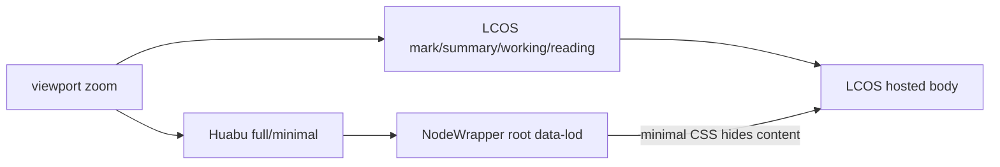
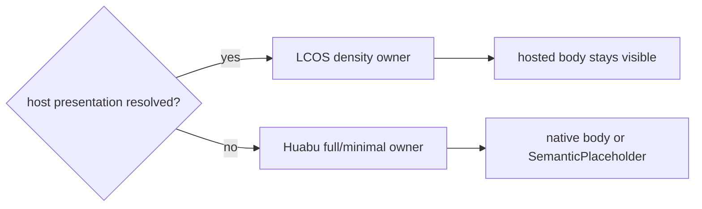

# GEN2 Node LOD 单一 Owner 施工交付

日期：2026-09-20

分支：`codex/lod-owner-r1`

范围：只修复 `NodeWrapper` 中 LCOS host 与 Huabu native binary LOD 的双 owner 冲突；未改节点密度规则、Core 数据、Canvas geometry 或产品流程。

## 结论

LCOS-hosted 节点现在只由 Gen2 的 `mark / summary / working / reading` 密度系统决定可见内容。Huabu native `full / minimal` 仍完整保留给 unbound / unsupported / stale / runtime unavailable fallback，不再在 LCOS host 已接管时把 body 隐藏。

## 失败场景与原因

低倍缩放时，LCOS 已把节点切到 `mark`，但 `NodeWrapper` 仍同时把 native LOD 切到 `minimal`。根节点的 `data-lod="minimal"` CSS 会隐藏 `.semantic-lod-content`，因此 LCOS mark 也一起消失。两个 LOD owner 同时写同一承载层，形成可见性冲突。

## 变更流程

变更前：

变更后：

## 实际修改

- `huabu/apps/web/src/components/Nodes/NodeWrapper.tsx`
  - 先解析 neutral host presentation。
  - 仅在 host presentation 不存在时启用 native LOD。
- `huabu/apps/web/src/hooks/useNodeLOD.ts`
  - 新增 `enabled` 参数与纯函数 `resolveNodeLODMode`。
  - disabled 时返回并重置为 `full`，避免 hysteresis 残留。
- `huabu/apps/web/src/components/Nodes/NodeWrapper.lcosLod.test.tsx`
  - 覆盖 LCOS 低倍 mark、高倍 reading、301 节点 density cap、native minimal fallback。
- `huabu/apps/web/src/hooks/useNodeLOD.test.ts`
  - 覆盖 native hysteresis、host 接管、未注册类型。

## 验证结果

| 检查 | 结果 | 证据 |
|---|---|---|
| targeted lint | PASS | 4 个改动源码/测试文件，exit 0 |
| targeted unit + DOM | PASS | 4 files / 14 tests |
| typecheck | PASS | `npm run typecheck` |
| production build | PASS | `npm run build`；仅既有 CSS pseudo-element、vendor annotation、chunk-size warnings |
| `git diff --check` | PASS | 无 whitespace error |
| LCOS low zoom | PASS | zoom `0.0972603`；9 个 host 全为 `density=mark`、`data-lod=full`、placeholder `0`、body visible |
| LCOS high zoom | PASS | zoom `1.24874`；出现真实 `density=reading`，host 仍为 `data-lod=full`、placeholder `0`、body visible |
| Huabu native fallback | PASS | 投影绑定前 9 个真实 native 节点中 7 个为 `minimal`、placeholder `1`、body hidden |
| page / runtime health | PASS | `/projects/lcos-gen2-dev/main`；单 Shell、单 ReactFlow、无 Vite overlay、console/page error 为 0 |

浏览器环境：仓库隔离栈 Core `43131` / Huabu `3011` / Vite `5273`，Chromium `1234`，viewport `1366×768`。干净 fixture 首次进入后通过真实“建立主画布”入口创建 Canvas，再等待 Core → Canvas projection 完成后执行 camera 缩小/放大。

截图证据（临时目录，不提交生成物）：

- LCOS low：`C:\Users\1\AppData\Local\Temp\trae\screenshots\lod-owner-r1-lcos-low.png`
- LCOS high：`C:\Users\1\AppData\Local\Temp\trae\screenshots\lod-owner-r1-lcos-high.png`
- native fallback 抓取同轮输出：`C:\Users\1\AppData\Local\Temp\trae\screenshots\lod-owner-r1-low.png`

## 风险与未完成

- 未新增 schema、依赖、契约冻结或额外 gate。
- 未改四档 LCOS density 的阈值，也未改 Huabu native threshold / hysteresis。
- 浏览器证据覆盖 Chromium desktop；未单独覆盖移动 viewport，因为本修复只涉及 Canvas 缩放 owner，不改变响应式布局。
- 隔离环境在验收前曾复用到缺 canvas 的旧 fixture；已用仓库脚本 `down → reset → up` 重建，并通过真实建立入口完成最终验证。此环境问题未计入产品错误。

## 回滚

回滚本次单一 commit 即可。回滚后 LCOS host 与 native LOD 会再次同时生效，低倍 LCOS mark 可能被 `data-lod="minimal"` 隐藏；Core / Canvas 数据无需迁移或恢复。

## 下一步

合并前只需审查本 commit；不需要额外迁移。按仓库纪律，本分支未 push。
