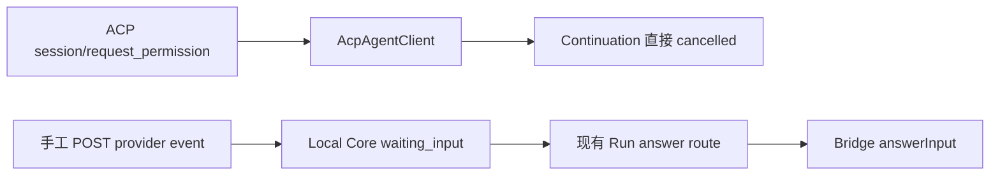

# Gen2 Provider / Agentlet `waiting_input` 真实纵切交接

日期：2026-09-20

分支：`codex/provider-waiting-input`

范围：ACP `permission_request` → Core Run `waiting_input` → Work View → 原回答路由 → 同一 ACP request 恢复

## 结论

已完成真实纵切。Huabu 的 ACP owner 不再把带 Run correlation 的权限请求直接取消，而是先登记原 `AcpSessionEntry`，再向 Local Core 投递标准 provider event。Core 校验 `lcosRunId + externalTaskId` 后，把已有 Run 和 pending input 持久化；用户仍通过现有 `POST /runs/:id/input-request` 回答，Core 根据持久化的 `responseTarget` 把 opaque option id 回送 Huabu，最终调用原 owner 的 `resolvePermission(requestId, { optionId })`。

重复事件与重复相同答案幂等；correlation、request payload 或重复答案冲突均 fail-close。Huabu owner 丢失时 Core 保持 `waiting_input` 与 pending request，不会只改成本地 `queued`。

## READ_SOURCE

- `README.md`
- `AGENTS.md`
- `docs/handoffs/GEN2_T6T7_TransportRecovery_Handoff_20260914.md`
- `docs/handoffs/GEN2_P1C_T7_HuabuHostTransport_20260915.md`
- `docs/audit/GEN2_T4_T7_HuabuChatPanel_to_ConversationWorkView_GAP_20260914.md`
- `docs/handoffs/GEN2_ProviderGoldenPath_RealFixture_20260920.md`
- Cabin T6/T7 原始施工卡入口与 T7 AgentAdapter 源码蓝图
- 当前 contracts、RuntimeApplicationService、RuntimeResultIngestion、Run routes、Huabu ACP driver / continuation owner 源码

## ADOPTED

- Core 继续作为 Run、pending input、状态和 Work View 的唯一事实源。
- 复用已有 `RuntimeApplicationService`、`RunInputRequestV1`、RuntimeBinding correlation 和 `POST /runs/:id/input-request`。
- Huabu 只持有当前 ACP turn 的瞬时 owner 映射，并负责把答案送回原 `AcpAgentClient`。
- Bridge 原有 waiting-input 回答路径继续使用 `responseTarget=bridge`；本纵切使用 `responseTarget=huabu-acp`，避免 Core 重启后误投递。

## 变更前流程

问题：ACP 真实事件没有进入 Core；即使手工让 Core 显示 `waiting_input`，回答也无法恢复 Huabu 中原本挂起的 request。

## 变更后流程

## 数据与用户操作变化

- 用户界面和操作入口未变：仍在 Work View 的 WaitingInputBody 查看问题并回答。
- `RunInputRequestV1` 新增可持久化 `responseTarget`；SQLite schema 从 54 升到 55。
- provider event 使用 Run ID、外部 task ID、request ID、prompt、opaque option IDs 和 `allowFreeText`。
- Core 重启后仍能识别该 pending input 必须回 Huabu；Huabu owner 消失时返回诚实失败。

## 修改文件

- Contracts：`packages/contracts/src/provider-run-event.ts`、`packages/contracts/src/index.ts`
- Core ingress / persistence / answer：
  - `apps/local-core/src/routes/runtime.ts`
  - `apps/local-core/src/runtime-result-ingestion.ts`
  - `apps/local-core/src/runtime-application-service.ts`
  - `apps/local-core/src/runtime-adapter.ts`
  - `apps/local-core/src/metadata-repository.ts`
  - `apps/local-core/src/index.ts`
- Core ↔ Huabu transport：
  - `apps/local-core/src/huabu-agentlet-host-transport.ts`
  - `apps/local-core/src/huabu-agentlet-continuation-adapter.ts`
- Huabu ACP owner：
  - `huabu/external/agenetes/packages/acp-driver/src/continuation-prompt.ts`
  - `huabu/apps/server/src/modules/agent/acp/continuation-transport.route.ts`
  - `huabu/apps/server/src/modules/agent/acp/provider-run-event-sink.ts`
  - `huabu/apps/server/src/modules/agent/acp/provider-run-input-registry.ts`
- 测试：对应 Core / Huabu 测试文件和 schema-version assertions。

## VERIFIED

- Local Core build：通过。
- Contracts typecheck + lint：通过。
- Local Core typecheck + lint：通过；lint 仅有仓库既有 warnings。
- Huabu Server typecheck：通过。
- 变更 Huabu / ACP 文件 ESLint：通过。
- Core 定向测试：6 files / 52 tests 通过。
- Huabu route + sink：2 files / 8 tests 通过。
- ACP continuation prompt：1 file / 3 tests 通过。
- 先前运行的 contracts tests：47/47 通过；web-gen2 tests：337/337 通过。
- `git diff --check`：通过。

真实/最近真实 fixture 证据：

- `apps/local-core/tests/work-view-projection.test.ts`：真实 HTTP Core；ACP-shaped permission 经生产 Huabu sink 进入 Core，重复投递、错误 task correlation、Work View 读取、SQLite reload、丢 owner 诚实失败、回答与同 Run queued 全覆盖。
- `huabu/apps/server/src/modules/agent/acp/continuation-transport.route.test.ts`：live owner prompt 发出 permission，Host forward，回答命中原 `resolvePermission`，同答幂等、异答冲突。
- `huabu/external/agenetes/packages/acp-driver/src/continuation-prompt.test.ts`：driver 的真实 permission notifier seam。

## VISUAL_SOURCE

未新增 UI。现有 Work View / WaitingInputBody 直接消费 Core 持久化投影；HTTP fixture 验证 UI 数据源。没有新增截图。

## RETIRED

- 带有效 Run correlation 的 continuation permission 不再走“无 UI 一律 cancelled”路径。
- 手工 POST provider event 仅作为接口调试能力，不再是纵切的唯一入口。

## 风险

- Huabu pending owner 是 ACP turn 的进程内真相；Huabu 重启后无法恢复已经断掉的 SDK request。Core 会保留 `waiting_input` 并返回 `PROVIDER_INPUT_NOT_FOUND`，需要重新 dispatch/retry，而不会假成功。
- Huabu resolved tombstone 只用于覆盖并发重试，TTL 5 分钟、最多 256 条；Core 的持久化 answered 状态承担长期幂等。
- schema 55 只增加一个带默认值的 routing 列；回滚代码前应先备份 DB，旧二进制不能打开 schema 55。

## UNRESOLVED

- 没有执行真实外部 Codex CLI 的破坏性权限操作；fixture 使用真实 ACP permission callback 和 HTTP 边界，但 agent process 为受控测试 owner。
- 仓库既有 `runtime-persistence.test.ts` 中两处 schema 50 旧断言此前已失败；本变更更新了当前 schema 54 断言到 55，没有扩大处理无关旧断言。

## 回滚

1. Revert 本提交。
2. 若数据库已迁移到 schema 55，先备份，再创建 schema 54 副本并移除 `run_input_requests.response_target`；SQLite 需要重建该表，不能直接 drop column 作为线上快捷操作。
3. Huabu 回滚后 correlated continuation permission 会恢复为 fail-close cancel，不会自动放行。

## 下一步

- 在连接真实 Codex ACP agent 的手工验收环境跑一次需要权限的文件操作，留存 provider 日志与 Work View 截图。
- 若要支持 Huabu 进程重启后继续原 turn，需要 ACP SDK/agent 提供可恢复的 pending permission 协议；当前没有伪造该能力。

## 最终审查补丁

### Provider 已恢复、Core 本地收口中断

Core 现在会在调用 Huabu 前，把选定答案写进仍为 `pending` 的原请求。若 Huabu 已成功恢复并把 Run 更新为 `queued`，但 Core 在将请求标成 `answered` 前中断，重启后的同答案提交会依据 `queued + pending + staged answer` 只完成本地收口，不重复调用 Provider。不同答案返回 `INPUT_RESPONSE_IDEMPOTENCY_CONFLICT`；没有 pending request 仍返回 `INPUT_REQUEST_NOT_FOUND`。

精确测试在 `apps/local-core/tests/runtime-application-service.test.ts`：测试让真实 provider response port 成功，再在 `answerRunInputRequest` 注入一次中断，验证 Run 为 queued、请求仍 pending、同答收口且 provider 只调用一次、异答拒绝。

### 标准 dev 栈双向环境

`scripts/dev-all.ps1` 启动 Core 子进程时显式设置：

- `LOCAL_CORE_API_TOKEN=dev-token`
- `HUABU_HOST_URL=http://127.0.0.1:3001`
- `HUABU_HOST_TOKEN=dev-token`

启动 Huabu 子进程时显式设置：

- `HUABU_CONNECTION_TOKEN=dev-token`
- `LCOS_CORE_URL=http://127.0.0.1:43121`
- `LOCAL_CORE_API_TOKEN=dev-token`

`apps/local-core/tests/dev-all-script.test.ts` 静态验证两个 child process 的完整环境；PowerShell parser 也已验证脚本语法。

### Provider event 输入收紧

Core ingress 现在 trim Run、Task、request、prompt、option 和 occurredAt 字符串，并拒绝空白关键值及 correlation/request 的未知字段。Huabu sink 在发请求前拒绝空 request/option ID；ACP owner 对非 canonical ID fail-close cancel，避免 trim 后无法反向命中原 permission request。
