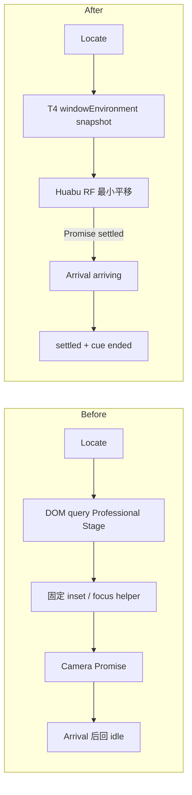

# GEN2 R6 · Locator / Camera / Arrival 生产纵向链交付

## 结论

Locator 已接入唯一的 T4 `windowEnvironment` 与唯一的 Huabu React Flow Camera。生产状态链现在由相机 Promise 驱动：

```text
Locate request
→ travelling
→ Huabu RF setViewport Promise settled
→ arriving
→ 720ms target-local cue
→ settled
→ cue removed
```

没有新增 Camera、Store、Bridge 或 Gate。

## 实际范围

- T4 `ProfessionalWindowStage → deriveProfessionalWindowEnvironmentV1 → lcosShellStore.windowEnvironment` 是唯一 `safeRect/occupiedRects` producer。
- Locator Camera 消费发布的 `safeRect`，按当前 zoom 做最小平移；不再查询 Professional Window DOM，也不再维护固定 Locator inset。
- 浮动窗口的 `occupiedRects` 只用于避让屏幕空间 Locator cue，不篡改 Camera 或 `safeRect`。
- Camera settle 使用既有 React Flow `setViewport()` Promise；移除 Locator 的猜时完成语义。
- Arrival reducer 保留可观测的 `settled` 生产态；正常完成不会被 effect cleanup 覆盖成 `cancelled`。
- 新 Locate、用户画布手势、目标缺失和相机失败会取消旧代；reduced-motion 使用 duration `0`，状态语义不变。
- 增加浏览器可观测 phase 属性与 fail-fast E2E，供真实运行时采样，不形成第二份状态。

## 变更前后



## 修改文件

- `apps/web-gen2/src/spatial/locatorGeometry.ts`
- `apps/web-gen2/src/interaction/arrivalState.ts`
- `apps/web-gen2/src/index.ts`
- `apps/web-gen2/test/locatorGeometry.test.ts`
- `apps/web-gen2/test/arrivalState.test.ts`
- `huabu/apps/web/src/components/Panels/CanvasLayerPanel/focusNodesOnCanvas.ts`
- `huabu/apps/web/src/components/Panels/CanvasLayerPanel/focusNodesOnCanvas.test.ts`
- `huabu/apps/web/src/lcos/navigation/LcosCanvasCommands.tsx`
- `scripts/e2e/locator-arrival-production.mjs`

## 验证

| 检查 | 结果 |
|---|---|
| `npm run typecheck:web-gen2` | PASS |
| `npm run test:web-gen2` | PASS · 334/334 |
| Huabu `focusNodesOnCanvas.test.ts` | PASS · 11/11 |
| 改动文件 ESLint | PASS · 0 warning |
| `pnpm --filter @huabu/web typecheck` | PASS |
| `pnpm --filter @huabu/web build` | PASS |
| `git diff --check` | PASS |
| `node scripts/e2e/locator-arrival-production.mjs` | PASS |

真实浏览器使用 `http://127.0.0.1:5274/projects/lcos-gen2-dev/main`，验证：

- Assembly Professional Window 打开并停靠后，发布 `safeRect={x:0,y:0,width:784,height:900}`；远端目标最终位于 `left=639,right=760`，没有进入右侧窗口。
- 拖动真实 west resize handle 扩宽窗口后，再次 Locate 仍消费更新后的环境。
- 40ms 内连续请求两个真实节点，采样到 `travelling → arriving → settled`；Arrival 只出现于第二个目标 `node-fd164d0d-0ad9-4493-9558-06944317f1fc`，没有旧目标串线。
- settled 后 `[data-lcos-arrival]` 与 `[data-lcos-locator]` 都为 0。

截图：`.e2e-data/shots/locator-arrival-production.png`（本地测试证据，不提交生成物）。

浏览器插件在当前环境不可用，因此按仓库现有 fail-fast harness 使用 Playwright Core；测试仍操作真实页面、真实窗口手势和真实 RF Camera。

## 已知环境噪音

测试 fixture 的 `/lcos-core/projects/lcos-gen2-dev/spatial/bindings` 返回既有 403；E2E 仅对白名单中的该状态放行并保留完整记录。它不影响本轮基于 Huabu Canvas Store 的 Camera/Arrival 验证，也未被写成成功能力。

## 风险与回滚

- 本轮保持当前 zoom，只做最小平移；超大目标无法完整放入 safeRect 时会居中于可用区域。
- 浮动 Professional Window 不缩小 Camera safeRect；它通过 `occupiedRects` 避让 Locator cue。停靠窗口才约束 Camera 可用区域，符合 T4 environment contract。
- 回滚点：本提交单独回滚即可恢复原 Locator consumer、原 Arrival reducer和原 Camera helper，不涉及 Schema 或持久化数据。

## 未完成

- 未改变搜索、Focus/Where、Worksite 切换的产品入口。
- 未新增视觉样式；Arrival 仍复用现有 outline cue。
- 未处理 fixture 的 Core 授权 403，属于本轮外部环境问题。
