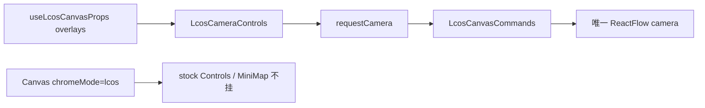
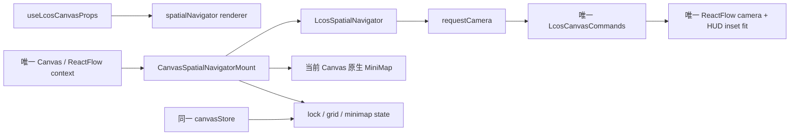

# GEN2 R6/T1 Spatial Navigator 生产纵向链交接（2026-09-20）

## 任务摘要

已把原 R6/T1 卡停在规划态的 Spatial Navigator 接进真实 LCOS 项目路由。生产面现在只有一个左下空间导航器：折叠态使用最新 Figma 的 52×48 CameraControl；展开后在同一 Huabu `<ReactFlow>` context 内组合当前画布 MiniMap、Zoom Out、Zoom Value / Reset、Zoom In、Fit、Lock、Grid 与 MiniMap toggle。

没有新增 camera、graph、viewport store 或 Canvas store。Zoom / Fit / Reset 仍发 `useLcosShellStore.requestCamera`，由既有唯一 `LcosCanvasCommands` 消费；其中 Fit 继续使用现有 HUD inset / SafeRect 取景路径。Lock 沿用 `Canvas.tsx` 的 interactivity owner，Grid 与 MiniMap preference 由同一个 `canvasStore` 持有并写入可丢失的 localStorage UI preference。

## 实际范围

- 新增 neutral `CanvasHostExtension.spatialNavigator` render-function seam，并在 web-gen2 host mirror 中 identity passthrough。
- `Canvas.tsx` 在唯一 ReactFlow context 中供应 zoom readout、当前 MiniMap、lock/grid/minimap 状态与 toggle。
- 退役 `useLcosCanvasProps` 对旧 `LcosCameraControls` 的 production mount；旧文件保留，不扩大物理删除。
- LCOS 分支无 renderer 时保持旧行为：不挂 stock Controls / MiniMap；非 LCOS 仍保留 Huabu stock UI。
- 新增 `canvasStore.gridEnabled/toggleGrid`，默认 `true`，session/canvas 切换共享且 reload 可恢复。
- 新增可复跑的真实浏览器门禁 `scripts/e2e/spatial-navigator-production.mjs`。

## 变更流程

### Before

旧 camera 浮岛只覆盖 Zoom/Fit，MiniMap、Lock、Grid 没有统一 LCOS production 入口。

### After

用户操作从“左下相机浮岛”升级为“点击 52×48 空间导航键 → 展开完整仪表”。切换 Main / Context 时组件绑定新的当前 canvas，MiniMap 不保留上一画布节点，也不会产生第二 graph。

## READ_SOURCE

- `README.md`：文档优先级、单 Project Canvas / Workspace Semantic Viewport、交付要求。
- `AGENTS.md`：Canvas owner、性能、localStorage UI preference、测试与 handoff 规则。
- `docs/handoffs/LCOS_Gen2_T2_C2-3B_SpatialNavigator_ExactSourceBlueprint_20260907.md`：§2 owner table、§5 neutral seam、§6 mount、§8 interaction、§10 acceptance。
- `docs/construction/GEN2_R1-R6_to_Wave3-10_ExecutionMap_20260919.md`：R6 当前 production tree 与 Spatial Navigator 缺口。
- `E:\TRAE项目\LCOS0.1收口\LCOS_Gen2_R1-R6_x_T1-T7_CurrentSource审查报告_第一轮_20260919.md` 及同目录第二、第三轮：R6×T1–T7 当前源审计。
- `E:\TRAE项目\LCOS0.1收口\_cabin\06_Figma\LCOS_Figma_全设计包_20260913\unification\specs\hud.json`：HUD 最新结构说明。
- `E:\TRAE项目\LCOS0.1收口\_cabin\06_Figma\LCOS_Figma_全设计包_20260913\unification\structures\shell\nodes-000.json`：`5386:274 Shell / CameraControl · collapsed` 精确几何。
- `huabu/apps/web/src/components/Panels/Canvas/Canvas.tsx`、`lcos/navigation/LcosCanvasCommands.tsx`、`lcos/useLcosCanvasProps.tsx`、`store/canvasStore.ts`：真实 production owner/caller。

## ADOPTED

| donor / symbol | target | production caller |
|---|---|---|
| Huabu `Canvas.tsx` ReactFlow context / `MiniMap` / lock mechanics | `CanvasSpatialNavigatorMount` | `CanvasHostBoundary → Canvas` |
| `useLcosShellStore.requestCamera` | `LcosSpatialNavigator` camera handlers | `useLcosCanvasProps.spatialNavigator` |
| `LcosCanvasCommands` `fitWithHud` / zoom/reset consumer | 保持原实现，不复制 | shell camera request |
| `canvasStore.minimapEnabled` | Navigator MiniMap visibility | `CanvasSpatialNavigatorMount` |
| 同一 `canvasStore` UI preference pattern | `gridEnabled/toggleGrid` | `Canvas.tsx` Background + Navigator toggle |
| web-gen2 `createHostSeam` / `hostExtensionFromSeam` | opaque `spatialNavigator` passthrough | `useLcosCanvasProps` |

## VISUAL_SOURCE

- 最新 Figma 只冻结 `5386:274` 折叠态：x=24、bottom=24、52×48、radius=20、grid glyph=17。production 截图实测 52×48。
- 展开态没有最新 Figma exact pixel 稿；按原 T2 C2-3B 卡的信息层级排列 mechanics，只使用已有 LCOS HUD surface、radius、spacing、text、focus token，没有新增自选装饰。
- 原卡写“replacement absent → stock parity”，但当前 LCOS `chromeMode` 的已发布行为是无 replacement 时隐藏 stock。最新执行裁决要求保持该行为，所以实现为：LCOS + 无 renderer → `null`；非 LCOS → stock Controls / conditional MiniMap。差异只记录在此，没有回写或冻结新 contract。

## RETIRED

- `LcosCameraControls` 不再被 `useLcosCanvasProps` mount；生产源码搜索只有其自身定义，无 caller。
- LCOS route 的 `.react-flow__controls` 始终为 0；stock Controls 不与 Navigator 并存。
- MiniMap 从“隐藏且无替代”改为 Navigator 内的同一个 ReactFlow primitive；始终只有一份。
- Locator、SurfaceDock、Railway 未被改成 camera/minimap owner，职责没有串线。

## 修改文件

- `apps/web-gen2/src/host/hostSeam.ts`
- `apps/web-gen2/src/integration/huabu/LcosCanvasAdapter.tsx`
- `apps/web-gen2/test/host-adapter.test.ts`
- `huabu/apps/web/src/components/Panels/Canvas/Canvas.tsx`
- `huabu/apps/web/src/lcos-seam/types.ts`
- `huabu/apps/web/src/lcos/navigation/LcosSpatialNavigator.tsx`
- `huabu/apps/web/src/lcos/navigation/LcosSpatialNavigator.test.tsx`
- `huabu/apps/web/src/lcos/ui/families/LcosSpatialNavigatorView.tsx`
- `huabu/apps/web/src/lcos/ui/families/lcos-hud-presentation.css`
- `huabu/apps/web/src/lcos/useLcosCanvasProps.tsx`
- `huabu/apps/web/src/lcos/useLcosCanvasProps.project.test.tsx`
- `huabu/apps/web/src/store/canvasStore.ts`
- `scripts/e2e/spatial-navigator-production.mjs`
- `docs/construction/{SOURCE_ADOPTION_LEDGER,HUABU_RETIREMENT_LEDGER,FIGMA_SOURCE_LEDGER}.md`

## VERIFIED

| 检查 | 结果 |
|---|---|
| `npm run typecheck:web-gen2` | PASS |
| `pnpm --filter @huabu/web typecheck` | PASS |
| 变更文件 ESLint | PASS，0 warning/error |
| `npm run test:web-gen2` | PASS，335/335 |
| `vitest run LcosSpatialNavigator.test.tsx useLcosCanvasProps.project.test.tsx` | PASS，5/5 |
| `npm run build --workspace @local-creative-os/web-gen2` | PASS |
| `pnpm --filter @huabu/web build` | PASS，4298 modules，只有既有 CSS/Rollup/chunk warning |
| `node scripts/e2e/spatial-navigator-production.mjs` | PASS，consoleErrors=[]，pageErrors=[]，HTTP errors=[] |

真实浏览器行为证据：

- Navigator=1，legacy camera family=0，stock Controls=0，MiniMap=1。
- 折叠尺寸 52×48；展开成功。
- Zoom readout 100%→85%，Zoom In 恢复变化；Reset 与 Fit 都改变同一 `.react-flow__viewport` transform。
- 锁定后真实节点拖拽前后 store position 均为 `{x:0,y:0}`。
- Grid / MiniMap 隐藏后 reload 仍隐藏；恢复后 Background/MiniMap 各一份。
- MiniMap pan 使 viewport 从 `translate(581.171px,390.298px)` 变为 `translate(321.971px,260.698px)`，zoom 保持 `0.78453`。
- Main canvas `canvas-fed16379…` → Context `canvas-04c0200…` → Main 原 id，三个阶段 Navigator 都只有一份。
- 截图：`.e2e-data/shots/spatial-navigator-production.png`。

全量基线补充：`pnpm --filter @huabu/web test` 在 fresh install（仓库无 pnpm lockfile，解析到 React 19.3 / react-router 7.18）下为 1602/1618，通过 250 个文件中的 243 个；16 个失败分布在既有 NavigatorIsland Router wrapper、FocusWhere safeRect fixture、ActionOrb、Reader、Milkdown 等，与本次变更文件无关。本次相关 5 项、生产 build 与真实浏览器均通过。`pnpm --filter @huabu/web lint` 的全仓基线有 36 errors / 213 warnings，集中在既有 e2e/import-order/no-undef 等文件；本次变更文件定向 lint 为 0。

## UNRESOLVED / 风险

- 最新 Figma 没有展开态 exact pixel spec；当前展开布局是原卡信息架构 + 现有 token 的最小生产实现。后续如果 Figma 补出展开态，只换 `LcosSpatialNavigatorView` / CSS，不动 owner/seam。
- Grid / MiniMap 是全局、可丢失的 UI preference，跨当前 canvas 共享并通过 localStorage 恢复；没有写 Local Core。Lock 是当前 Canvas mount 生命周期状态，切 canvas / reload 后回到未锁定。
- 全量 Huabu test/lint 基线没有清零；未为本任务扩大修复无关历史失败。

## 下一步与回滚

下一步只需在合并环境用受控依赖版本重跑 Huabu 全量 test/lint，并由设计侧补展开态 exact source 后做纯 presentation 校准。

回滚本提交即可恢复旧 production camera caller 与 LCOS 下无 MiniMap 的状态；没有 schema、Core 数据或 graph 迁移。若只回滚 UI，可移除 `useLcosCanvasProps.spatialNavigator` 注入并恢复旧 overlay，但需同步回滚 Canvas seam/ledger，避免留下不可达接口。
