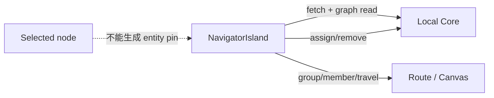
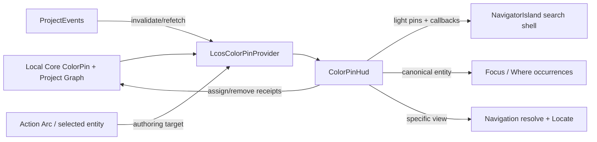

# LCOS Gen2 · T2 Color Pin Owner Topology Production Vertical

日期：2026-09-20

分支：`codex/colorpin-owner-vertical`

基线：`frontend-reconstruction-v2@12a5e6c0762a9184553892756102b26c98231da2`

## 结论

Color Pin 已从 `LcosNavigatorIsland` 的内嵌业务拆回 ProjectSession 级 owner：`LcosColorPinProvider` 是唯一读投影与 CRUD owner，`ColorPinHud` 负责颜色组交互，Navigator 只保留搜索与轻量 `pins/callbacks` 呈现。Action Arc 会为已绑定节点创建 canonical entity pin；显式 View 保持 occurrence pin；无选择时才允许 surface pin。

实体成员的“前往”复用既有 Focus/Where occurrence chooser，View 成员复用 Core navigation resolve、worksite settlement 与 Locate，没有新增 camera、geometry 或 durable store。V0 untyped entity ref 遇到跨实体表同 ID 会 fail-close，不再按 Note→Conversation→Scope→Workspace→Artifact 顺序静默猜错对象。

## 实际范围

- 新增 ProjectSession 级 `LcosColorPinProvider`，消费现有 `CoreColorPinClient`、Project graph 与 ProjectEvents。
- 新增 `ColorPinHud`，拥有 palette、assign、remove、group/member 与 travel。
- Action Arc `color-pin` producer 保留已知 `entityType/entityId` 直到 adapter 决定 target；Artifact 生成 `kind=entity`，显式 View 生成 `kind=view`。
- Focus/Where 接受外部 canonical entity 请求，并从现有 bindings 枚举跨 Main/Context/Workflow occurrence。
- Navigator 删除 Color Pin fetch/CRUD/group/travel，仅消费轻量 pin view model 与 callbacks。
- Local Core entity resolver 增加 Artifact，并对 V0 exact-id 多候选 fail-close。
- 增加真实 Chromium headless 纵切和 SQLite reopen 持久化验证。
- 无 schema migration、无新依赖、无新 camera/geometry truth、无第二套 pin store。

## 变更流程

### 变更前

### 变更后

用户操作变化：选中已绑定 Artifact/View 后，通过 Action Arc 的“标为颜色组”打开 picker；颜色组从 Navigator 入口展开成员；canonical entity 先展示具体 occurrence，再前往；成员可移除，reload 后以 Core 持久化结果为准。

数据流变化：Core 仍是唯一真值。Provider 只保存当前项目 read projection 与 derived indexes；成功 mutation 按 receipt refetch，失败不乐观伪造成功；项目切换递增 generation，旧项目的 read/mutation completion 不得写入新项目。

## Owner 与 exact caller

| 职责 | Owner | Production caller |
|---|---|---|
| Color Pin read projection / CRUD | `lcos/pin/LcosColorPinProvider.tsx` | `LcosProjectShell` ready ProjectSession subtree |
| Palette / group / member / travel UI | `lcos/pin/ColorPinHud.tsx` | `LcosGlobalHud` |
| Entity producer | `LcosActionArc.tsx` → `colorPinTargetFromEntityRef` | bound node Action Arc command |
| Explicit View producer | `colorPinTargetFromEntityRef` | explicit `entityType=view` authoring target |
| Surface fallback producer | `ColorPinHud.tsx` → `resolveSurfaceMarkerTargetV1` | no selected/bound entity target |
| Multi-occurrence choice | `LcosFocusWhere.tsx` + `lcosShellStore.requestFocusWhere` | ColorPin entity member travel |
| Search / light pin shell | `LcosNavigatorIsland.tsx` | `ColorPinHud` passes `pins/onActivatePin/onCreatePin` |

## Source adoption record

### READ_SOURCE

- `C:\Users\1\Desktop\222\LCOS_Gen2_T2_C2-2C_ColorPin_ExactSourceBlueprint_20260907.md`：§30–40 Provider、§47–50 HUD/member travel、§55–60 authoring target、§67–70 geometry/presentation adapter、§71–72 placement/project boundary、§84–101 file/test/browser gates。
- `C:\Users\1\Desktop\222\LCOS_Gen2_T2_C2-2_SearchFocusColorPin_IntegrationCheckpoint_20260907.md`：§1 responsibilities、§2 keep owners、§3 migrate/retire、§4 occurrence truth、§5 remote navigation、§6 geometry、§9 planned files、§11 no-new-owner。
- `docs/handoffs/LCOS_Gen2_T2_TO_T5_NavigationPresentation_BlueprintIndex_20260907.md`：Focus/Where 与 Color Pin owner、HUD/camera ownership。
- `docs/construction/FIGMA_SOURCE_LEDGER.md` 与 current exact source：`deliverables/GEN2_新前端重新总装正本_20260913/references/figma-master/unification/`。

### ADOPTED

- `LcosColorPinProvider` → ProjectSession 级唯一 read projection/CRUD owner → `LcosProjectShell`。
- `ColorPinHud` → palette/group/member/travel → `LcosGlobalHud`。
- `colorPinTargetFromEntityRef` → canonical view/entity authoring adapter → Action Arc/HUD。
- `requestFocusWhere` → canonical entity occurrence chooser → Color Pin member travel。
- `NavigationMarkerService.#resolveEntity` → unique exact-id compatibility resolver → Core navigation API。

### VISUAL_SOURCE

- NavigatorIsland family：Figma `5384:367`。
- Global HUD：Figma `5388:27696`。
- Color Pin 语义纠正：Figma 00 page `5409:2`。
- 沿用现有 token 与 family shell，没有自由视觉发挥。

### RETIRED

- `LcosNavigatorIsland` 内的 Color Pin snapshot fetch、graph fetch、palette state、assign/remove、group/member、travel 与 generation owner（净删除约 400 行）。
- untyped entity resolver 的固定表优先级猜测。

### VERIFIED

- Huabu targeted ESLint：通过，0 warning。
- Huabu `npm run typecheck`：通过。
- Huabu 6 files targeted Vitest：37/37 通过。
- Huabu `npm run build`：通过；只有既有 CSS `::highlight`、third-party annotation/eval 与 chunk-size warnings。
- web-gen2 `npm run typecheck`：通过。
- web-gen2 targeted Node tests：12/12 通过。
- web-gen2 `npm run build`：通过。
- Local Core `npm run typecheck`：通过。
- Local Core targeted oxlint：通过，0 warning。
- Local Core navigation/color-pin Vitest：12/12 通过。
- root `npm run build:local-core`：通过。
- Chromium headless：assign Artifact entity → HUD pin 出现 → 打开组 → Focus/Where 显示 2 个 occurrence → 前往 Context occurrence → remove → reload 后 membership 仍为空；console/page/http failures 均为空。
- 全仓 Huabu `npm run lint` 仍失败于既有 36 errors / 213 warnings（集中在 `e2e/lcos-collab-*`、collaboration/composer/drop 等未改文件）；本轮修改文件的 targeted ESLint 为 0 warning。
- Local Core 全量 `npm run check` 的 lint/typecheck 通过到 test 阶段，但多项既有 schema/vector/resource 测试失败；本轮 exact `navigation-marker-f6a2.test.ts` 12/12 与 targeted oxlint/typecheck/build 均通过。为避免扩大范围，未修改无关基线。

### UNRESOLVED

- `SpatialMarkerTargetRefV0.kind=entity` 仍不持久化 `entityType`。本轮以 exact-id 唯一候选解析；0 或多候选返回现有 `target-missing`。最终 typed target migration 仍归 T6/shared Core。
- Figma Pin 原生 SVG 尚未采用，沿用现有 family 的 lucide mark；这不是本轮 owner/vertical slice 范围。
- 本轮只验证浅色真实页面，没有新增深色人工视觉走查。

## 修改文件

- `apps/local-core/src/navigation-marker-service.ts`
- `apps/local-core/tests/navigation-marker-f6a2.test.ts`
- `apps/web-gen2/src/index.ts`
- `apps/web-gen2/src/interaction/nodeCommandModel.ts`
- `apps/web-gen2/src/presentation/colorPinPresentation.ts`
- `apps/web-gen2/test/colorPinPresentation.test.ts`
- `apps/web-gen2/test/node-command-model.test.ts`
- `docs/construction/FIGMA_SOURCE_LEDGER.md`
- `huabu/apps/web/src/lcos/navigation/LcosActionArc.tsx`
- `huabu/apps/web/src/lcos/navigation/LcosFocusWhere.tsx`
- `huabu/apps/web/src/lcos/navigation/LcosNavigatorIsland.tsx`
- `huabu/apps/web/src/lcos/pin/ColorPinHud.tsx`
- `huabu/apps/web/src/lcos/pin/ColorPinHud.test.tsx`
- `huabu/apps/web/src/lcos/pin/LcosColorPinProvider.tsx`
- `huabu/apps/web/src/lcos/pin/LcosColorPinProvider.test.tsx`
- `huabu/apps/web/src/lcos/pin/lcosColorPinPalette.ts`（从 navigation 移入 owner 目录）
- `huabu/apps/web/src/lcos/shell/LcosGlobalHud.tsx`
- `huabu/apps/web/src/lcos/shell/LcosProjectShell.tsx`
- `huabu/apps/web/src/lcos/shell/LcosProjectShell.project.test.tsx`
- `huabu/apps/web/src/lcos/shell/lcosShellStore.ts`
- `scripts/e2e/colorpin-owner-vertical.mjs`

## 浏览器与持久化证据

- 隔离数据目录：`C:\Users\1\AppData\Local\Temp\lcos-colorpin-e2e-20260920`
- target：`artifact-ambientAudio`
- occurrence count：`2`
- assign membership：`color-pin-membership-efac1fae-588f-417b-be39-e1618f64d107`
- screenshot：`E:\OS开发\LCOS_GEN2_COLORPIN_OWNER_20260920\.e2e-data\shots\colorpin-owner-vertical.png`
- 截图处于 entity travel 的 Focus/Where chooser，显示 Main 当前 occurrence 与 Context 可前往 occurrence。
- `navigation-marker-f6a2.test.ts` 另以关闭/重开 SQLite repository 验证 assign 存在、remove 后为空。

## 风险、成本与回滚

开发成本集中在三处：owner 拆分、canonical target adapter、复用 occurrence travel；没有 schema 或依赖成本。

剩余主要风险是 V0 entity ref 无类型，因此不同实体表同 ID 无法无损导航。本轮选择 fail-close，避免错误对象跳转；已用 Artifact+Note 同 ID 测试钉住。

回滚点是本提交：整体 revert 即可恢复旧 Navigator 内嵌 Color Pin。数据库 schema 和既有 membership 数据未变，不需要数据回滚。

## 验收与下一步

已满足：唯一 CRUD owner、Action Arc entity producer、多 occurrence 复用、view/entity/surface target、group/member/travel/remove、reload 持久化、项目切换迟到回包隔离、V0 冲突 fail-close、真实浏览器纵切。

下一步只应在 shared Core 正式批准 typed entity target migration 后扩 contract；不要在前端私加第二份 entity type 真值。
