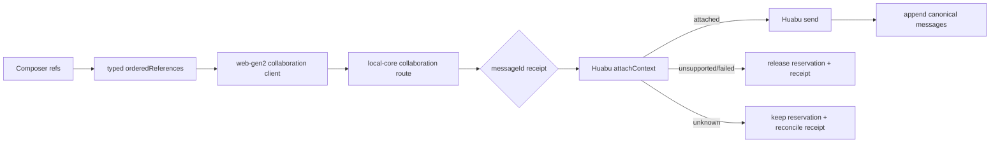

# GEN2 Wave10：Continuation selected references attach vertical slice

## 结论

在 `b3dcbb6` 隔离 worktree 完成 Composer → web-gen2 → collaboration contract → local-core → Huabu adapter 的真实调用链。Huabu 当前没有权威 `attachContext` RPC，因此 attach 明确返回 `unsupported`，不会伪造 provider 成功，也不会继续发送 prompt。

## READ_SOURCE

- `AGENTS.md`、`README.md`
- `docs/handoffs/GEN2_Wave10_原会话续聊产品闭环_20260920.md`
- `docs/handoffs/GEN2_Wave8_ConversationCapabilityVerticalSlice_20260920.md`
- `docs/handoffs/GEN2_CollaborationContractV1_Gate1_Freeze_20260917.md`
- `docs/handoffs/GEN2_Gate2-5_CollaborationMigration_20260917.md`
- `docs/handoffs/GEN2_Wave5_Composer_SingleHost_20260920.md`
- T5：`E:\TRAE项目\LCOS0.1收口\_cabin\01_正本\GEN2_新前端重新总装正本_20260913\references\original_route_cards\T5\LCOS_Gen2_T5_ContextWorkflow交互专项_前端施工正本_V3_20260910.md`
- T7：`E:\TRAE项目\LCOS0.1收口\_cabin\01_正本\GEN2_新前端重新总装正本_20260913\references\original_route_cards\T7\GEN2_T7_Glyth续工_AgentAdapter源码蓝图施工正本_V2_20260911.md`

## ADOPTED

- Composer 复用 `buildSelectedContextReferences` 的 `OrderedRunReferenceV2`；支持 artifact/view/scope/workspace/conversation/component，未知实体在 UI fail-close。
- `CollaborationSendInputV1.orderedReferences` 由 web-gen2 原样传给 `/collaboration-send`。旧 `targetRefs` 非空仍 409，避免显示键冒充 context truth。
- `ConversationContinuationService.sendPrompt` 将每次 send 的引用按 `messageId` 写入既有 `continuation_operation_journal.journal_json` 的 `promptReceipts`。session 创建时的 `orderedReferences` 仍是创建快照，不再被后续续聊覆盖或锁死。
- 每条 receipt 分阶段保留 `attachReceipt` 与 `sendReceipt`，并保留 `receipt` 作为最新诊断值。attach 已确认时，同一 messageId 重试复用证据，不重复 attach。
- `HuabuAgentletContinuationAdapterV1.attachContext` 继续诚实返回 `unsupported / attach_context_unsupported`。explicit unsupported/failed 会释放 prompt reservation；unknown/unresolved 保留 reservation，等待 reconcile。
- RecoverySection 展示每条 prompt 的 attach/send receipt，方便逐条诊断。

## VISUAL_SOURCE

复用现有 unified Composer、Conversation Work View RecoverySection 和既有 T5/T7 UI 语义；没有新增视觉事实源或独立 context store。

## RETIRED

无。原有 session-level selected-context 创建链保持不变；只移除了 send 路径把 refs 写回 session operation 的错误做法。

## 流程变化

## 修改文件

- `packages/contracts/src/collaboration-contract.ts`
- `packages/contracts/src/conversation-continuation.ts`
- `apps/web-gen2/src/backend/collaboration.ts`
- `apps/local-core/src/routes/conversation-continuation.ts`
- `apps/local-core/src/routes/collaboration.ts`
- `apps/local-core/src/conversation-continuation-service.ts`
- `apps/local-core/tests/collaboration-send.test.ts`
- `apps/local-core/tests/conversation-continuation-service.test.ts`
- `apps/web-gen2/test/collaboration-client.test.ts`
- `huabu/apps/web/src/lcos/composer/composerSubmission.ts`
- `huabu/apps/web/src/lcos/composer/composerSubmission.test.ts`
- `huabu/apps/web/src/lcos/composer/LcosComposerHost.tsx`
- `huabu/apps/web/src/lcos/professional/RecoverySection.tsx`

## VERIFIED

- `node_modules/.bin/tsc -p packages/contracts/tsconfig.json --noEmit --pretty false`：PASS
- `npm run build:contracts`：PASS
- `npm run build --workspace @local-creative-os/local-core`：PASS
- `vitest run apps/local-core/tests/collaboration-send.test.ts --maxWorkers=1`：9 passed
- `vitest run apps/local-core/tests/conversation-continuation-service.test.ts --maxWorkers=1`：14 passed
- `vitest run apps/local-core/tests/continuation-provider-contract.test.ts apps/local-core/tests/conversation-continuation-service.test.ts --maxWorkers=1`：32 passed
- `vitest run huabu/apps/web/src/lcos/composer/composerSubmission.test.ts --maxWorkers=1`：6 passed
- `tsx --test apps/web-gen2/test/collaboration-client.test.ts`：21 passed
- `git diff --check`：PASS
- metadata journal 的 `save/get/list` 已验证 `promptReceipts.attachReceipt` JSON round-trip；无需 schema migration，因为字段存于既有 `journal_json`。

## 未完成 / 风险

- `HuabuAgentletContinuationAdapterV1` 的 provider capability `attachContext` 仍为 unknown，真实 provider attach 尚未接通；本提交不会宣称 context 已进入 provider。
- local-core 全量 typecheck/build 基线中缺少 `@napi-rs/canvas`、`pdfjs-dist`、`fflate` 时会失败；本 worktree 已借用已有主仓依赖 junction，local-core build 已通过。web-gen2/Huabu typecheck 仍受 worktree 缺少 `react`、`lucide-react` 依赖阻塞，非本改动引入。

## 回滚 / 下一步

回滚本地 commit 即可恢复原有“续聊带 refs 直接 fail-close”行为；没有数据库迁移。下一步只有 provider 提供权威 attach RPC/probe 后，才实现 adapter attach 成功分支并补 provider integration test；`sendResource` 不可作为替代。

## 交付状态

- worktree：`E:\OS开发\LCOS_Gen2_worktrees\continuation-attach-vertical`
- baseline：`b3dcbb6`
- push：未执行
- commit：见父任务回报
