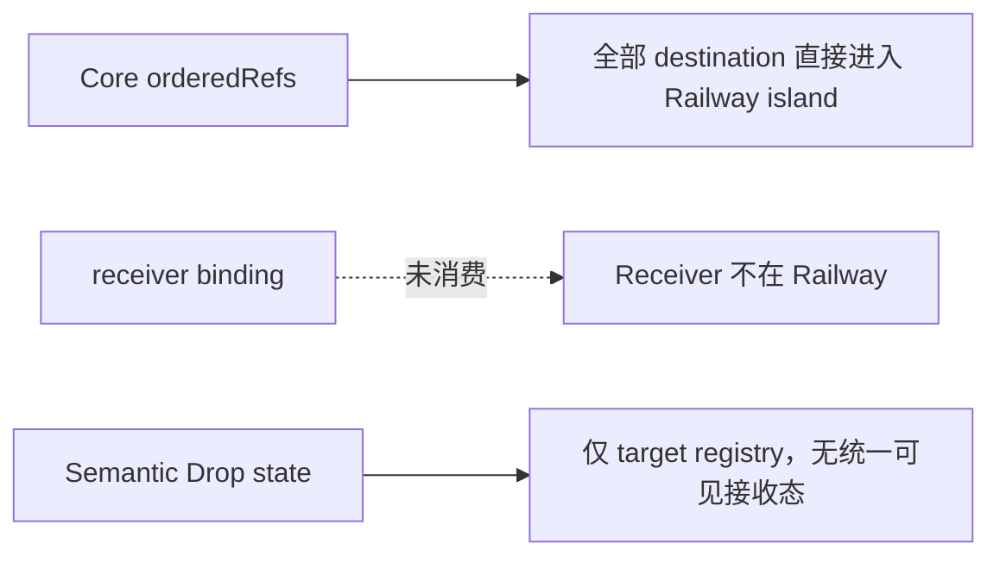
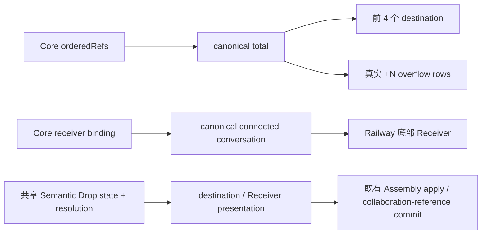

# GEN2 Wave 4 · Railway canonical overflow / Receiver / Receive presentation 施工交付

日期：2026-09-20

分支：`codex/spatial-navigator-r6`

结论：Railway 已把 canonical 总数、真实 `+N` overflow、active Receiver 和 Semantic Drop 接收态接到 production caller；隔离 Chromium 全栈验收通过。

## 实际范围

- `CoreConversationClient` 读取 `/projects/:projectId/receiver-binding`，不在 UI 猜 active Receiver。
- Railway ordered island 固定显示最多 4 个已解析目的地；`+N` 来自完整 Core `orderedRefs`，打开后展示真实 overflow rows。
- active Receiver 独立放在 ordered island 下方，点击沿用现有 Conversation Professional Window action。
- destination 与 Receiver 复用共享 Semantic Drop state/resolution；targetless `failed` 只在 Railway footer 显示一次，不给所有目的地伪造失败身份。
- Receiver 是否可接收使用 canonical `projectConnectedConversationStatusV1`；`offline` fail-closed。
- 未增加 schema、数据库、第二套 store、第二套 drop taxonomy 或新 gate。

## 流程变化

变更前：

变更后：

用户操作变化：Railway 默认保持紧凑；目的地超过 4 个时点击 `+N` 查看和进入真实剩余目的地；底部 Receiver 可直接打开当前承接会话。

数据流变化：新增 receiver-binding 只读链；目的地顺序仍由 Core Railway CAS 拥有，接收提交仍由既有 drop resolver/commit owner 负责。

## 六字段回传

`READ_SOURCE`

- `E:\OS开发\LCOS_GEN2_SPATIAL_NAV_20260920\docs\handoffs\LCOS_Gen2_T2_C2-4A_RailwayReceive_ExactSourceBlueprint_20260907.md`：Railway Receive、destination/Receiver ownership、T2/T3/T6 边界。
- `E:\OS开发\LCOS_GEN2_SPATIAL_NAV_20260920\docs\handoffs\GEN2_Wave4_Railway_Peek_Receive_More_20260919.md`：现有 production caller、Receive 与 More 基线。
- `E:\OS开发\LCOS_GEN2_SPATIAL_NAV_20260920\docs\construction\GEN2_FRONTEND_UX_RUNTIME_CONTRACT.md`：Railway runtime invariant、Core/Huabu/UI owner。
- `e:\TRAE项目\LCOS0.1收口\_cabin\01_正本\GEN2_新前端重新总装正本_20260913\10_T1-T7原始施工卡阅读入口.md`：T2 原件入口与 Wave 4 映射。

`ADOPTED`

- Core `GET /projects/:pid/receiver-binding` → `CoreConversationClient.getReceiverBinding` → `LcosRailway` production caller。
- 既有 `projectConnectedConversationStatusV1` → Receiver enabled/offline 判定。
- 既有 `useLcosDropStore` + `DropIntentResolver` resolution → `railwayReceivePresentation` → destination / overflow / Receiver 可见状态。
- 既有 `LcosRailwayView` family → canonical count / overflow / Receiver 编排；没有引入第二套 Railway。

`VISUAL_SOURCE`

- Figma Railway `5385:283`，目的地 1 / 4 变体；4 个 destination 仍保持 52×178 island 几何。
- Receiver 与 overflow 使用现有 LCOS HUD token/material；无新增业务状态。

`RETIRED`

- 退役“全部 destination 挤进同一个滚动 island”的当前呈现。
- 退役静态/近似 `+N` 与 UI 自猜 Receiver 的路径；SurfaceDock 三现场入口不变。

`VERIFIED`

- 真实隔离 Local Core + fake Light Bridge + Huabu server + Vite + Chromium，1365×900。
- production route：`/projects/<railway-fixture>/main`。
- canonical order 22；island 4；`+18` 打开 18 个真实 overflow rows；Receiver 位于 island 外；无 Vite overlay、`console.error` 或 `pageerror`。
- 截图：`C:\Users\1\AppData\Local\Temp\lcos-e2e-1972-3140e8eb-1bf5-44f2-ae38-080062483016\test-results\lcos-collab-r2r3-R3-1-Rail-465d3-Core-真值（非-page-local-graph）\test-finished-1.png`。

`UNRESOLVED`

- 物理跨 Space transfer 仍不在本批范围；Railway Receive 继续是 preserve-source 的 semantic receive。
- 本批未新增 mobile 专项；Railway 现有 responsive/LOD 规则保持原样。

## 修改文件

- `apps/web-gen2/src/backend/conversations.ts`
- `apps/web-gen2/test/t4-professional-windows.test.ts`
- `huabu/apps/web/src/lcos/navigation/railwayReceivePresentation.ts`
- `huabu/apps/web/src/lcos/navigation/railwayReceivePresentation.test.ts`
- `huabu/apps/web/src/lcos/shell/LcosRailway.tsx`
- `huabu/apps/web/src/lcos/ui/families/LcosRailwayView.tsx`
- `huabu/apps/web/src/lcos/ui/families/lcos-hud-presentation.css`
- `huabu/apps/web/src/lcos/ui/families/lcosFamilies.test.tsx`
- `huabu/apps/web/e2e/lcos-collab-r2r3.spec.ts`
- 本 handoff。

## 验证结果

| 检查 | 结果 |
|---|---|
| `npm run typecheck --workspace @local-creative-os/web-gen2` | PASS |
| `npm run build --workspace @local-creative-os/web-gen2` | PASS |
| `npm run test --workspace @local-creative-os/web-gen2` | PASS，334 tests |
| `pnpm --filter @huabu/web typecheck` | PASS |
| `pnpm --filter @huabu/web build` | PASS；仅既有 CSS pseudo-element / chunk size warning |
| changed source targeted ESLint | PASS |
| `railwayReceivePresentation.test.ts` | PASS，4/4 |
| `lcosFamilies.test.tsx -t Railway` | PASS，3/3（其余 7 skipped） |
| isolated Playwright R3-1 | PASS，1/1，38.6s |
| `git diff --check` | PASS |

全量 Huabu lint 当前仍被仓内既有基线阻塞：36 errors / 213 warnings，主要来自旧 e2e import/style 与无关文件；本次 changed source 定向 lint 为 0 error。`lcosFamilies.test.tsx` 全文件运行时，既有 `SurfaceFeedback 覆盖 Figma 7 呈现` 会因 React 双实例触发 invalid hook；本次 Railway 定向 3/3 通过。

## 风险、回滚与下一步

- 风险：Receiver 与 Railway order 分别读取，极短窗口可能先出现其一；两者都是 canonical 只读投影，不会产生错误写入。
- 回滚：revert 本提交即可；无 schema/migration、无新依赖、无不可逆数据写入。
- 下一步：用户手测 `+N` 打开/关闭、Receiver 打开会话、真实拖入 destination/Receiver 的 hover/commit 反馈。
