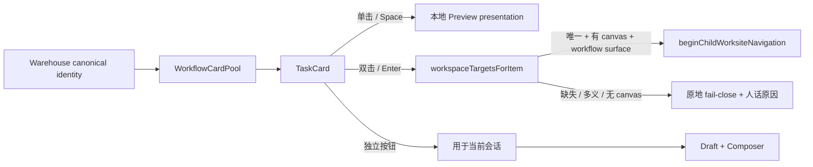

# GEN2 Workflow TaskCard 预览与现场进入纵向链施工交付

```text
BASE: frontend-reconstruction-v2@df9fec4
BRANCH: codex/workflow-card-preview-enter
STATUS: IMPLEMENTED / COMMITTED AFTER FINAL CHECK / NOT PUSHED
SCOPE: Workflow Hand TaskCard preview + canonical child-worksite entry + first-viewport layout
```

## 结论

Workflow TaskCard 已接成一条真实且不串语义的纵向链：

- 单击只切换卡池内部的轻量预览态，不加入草稿、不打开 Composer、不创建 Run；
- 双击或聚焦后按 `Enter` 才请求进入目标现场；
- 进入只接受 Warehouse producer 给出的 canonical `kind + entityRef`，再复用既有 Workspace target resolver 与 Portal / child-worksite navigation owner；
- 目标缺失、多义、无画布或不是 Workflow surface 时留在原现场，并显示人话原因；
- 技能没有独立现场，仍可预览或通过独立按钮用于当前会话；
- `用于当前会话` 仍是唯一 take 动作，卡片单击、双击和 Enter 不会重复 take；
- Task lane 固定在手牌主区首屏，材料与会话 lane 压成后续紧凑区，不再把 TaskCard 挤出视口。

## 读取依据

### 产品与交互

- `README.md`
- `AGENTS.md`
- `LCOS_Gen2_T5_ContextWorkflow交互专项_前端施工正本_V3_20260910.md` §9.1–10：卡牌 anatomy、单击预览、双击 / Enter 进入、Card Pool 搜索与筛选。
- Figma TaskCard `5335:110` 与 preview state `5335:41`。
- `LCOS_GEN2_Figma设计合同轻包_仅MD_20260914__unzipped/05_集合跨视图与工作流取用.md`
- `LCOS_Figma_全设计包_20260913/adoption/GEN2_Figma_集合跨视图与工作流取用_实际交付_20260911.md`

### 源码 owner

- `WorkflowCardPool.tsx`：Warehouse / Skill producer consumer、搜索、lane、take caller。
- `WorkflowTaskCardView.tsx`：TaskCard presentation 与键盘 / 指针语义。
- `workflowCardSemantics.ts`：task / material / receiver 物种边界。
- `workspaceTargets.ts`：canonical `scopeId → Workspace.scopeId` 目标解析。
- `childWorksiteNavigation.ts`：Portal / child-worksite 导航、返回来源与 URL owner。
- `LcosProjectShell.tsx`：Main / Workflow 两处 Hand caller 和 Workspace projection。
- Core Warehouse / Workflow producer：卡片 identity 与 Workspace scope truth。

## 变更前后

### 变更前


### 变更后



## 复用与边界

### ADOPTED

- `workspaceTargetsForItem()`：继续拥有 canonical target resolution；本批不复制 resolver。
- `childSurfaceForItem()`：继续决定目标 Surface；不从 title、meta 或 kind 文案猜入口。
- `beginChildWorksiteNavigation()`：继续拥有 URL、source return 与 Portal / child-worksite 进入语义。
- `useLcosReferenceStore` + `openComposer()`：只由卡内独立 take 按钮调用。

### RETIRED

- 退役 TaskCard 只能取用、不能预览 / 进入的断链状态。
- 退役材料 / 会话 lane 与 Task lane 同等占位并把任务卡挤出首屏的布局。

### 未新增

- 没有第二套 workflow graph / store / router。
- 没有新增数据库、schema 或 backend route。
- 没有用标题、展示类型、卡面文案推断目标。
- 没有让 Card activation 代替 take，也没有伪造 Run。

## 修改文件

- `huabu/apps/web/src/lcos/shell/LcosProjectShell.tsx`
- `huabu/apps/web/src/lcos/surfaces/workflow/WorkflowCardPool.tsx`
- `huabu/apps/web/src/lcos/surfaces/workflow/WorkflowWorksite.tsx`
- `huabu/apps/web/src/lcos/ui/workflow/WorkflowTaskCardView.tsx`
- `huabu/apps/web/src/lcos/ui/workflow/workflow-hand.css`
- `huabu/apps/web/src/lcos/surfaces/workflow/WorkflowCardPool.test.ts`
- `huabu/apps/web/src/lcos/ui/spatial/Stage6Presentation.test.tsx`
- `huabu/apps/web/src/lcos/ui/workflow/workflowCollectionWiring.test.ts`

## 验证

### 代码

- `corepack pnpm typecheck`（`huabu/apps/web`）：通过。
- `corepack pnpm vitest run src/lcos/surfaces/workflow/WorkflowCardPool.test.ts src/lcos/ui/workflow/workflowCollectionWiring.test.ts src/lcos/navigation/workspaceTargets.test.ts src/lcos/navigation/childWorksiteNavigation.test.ts`：4 files / 15 tests 通过。
- 针对 8 个改动 TS / TSX 文件运行 ESLint：通过，0 warning。
- `corepack pnpm build`（`huabu/apps/web`）：通过；只有 PDF CSS、lottie eval 与 chunk size 既有构建 warning。
- `git diff --check`：通过。

### 生产路由浏览器

运行：`http://127.0.0.1:5274/projects/lcos-gen2-dev/main`，1440×900，真实 Core / Huabu server，当前已导入 canonical workflow：`真实工作流导入验收`。

Playwright fail-fast 收据：

```json
{
  "scenario": "workflow-card-preview-enter",
  "ok": true,
  "failures": [],
  "consoleErrors": [],
  "pageErrors": [],
  "http": []
}
```

实际验证：

- TaskCard 完整落在首屏：`x=261.77, y=518.11, width=246.06, height=338.84`；底边约 `856.95 < 900`。
- 材料 / 会话 lane 没有把 TaskCard 挤出主视口。
- 单击后 `data-state=预览`，未出现 Composer，草稿引用未增加。
- 当前真实 workflow 对应 3 个 Workspace，`data-entry-available=false`；按 Enter 留在 Main 并显示“对应 3 个现场，暂时无法确定入口”。
- 点击独立 `用于当前会话` 后才出现 Composer；卡面切换 `草稿中`，引用恰好 1 条。
- 截图：`C:\Users\1\AppData\Local\Temp\LCOS_GEN2_workflow_card_preview_20260920.png`
- 截图：`C:\Users\1\AppData\Local\Temp\LCOS_GEN2_workflow_card_draft_20260920.png`

## 诚实限制 / GAP

1. 当前真实数据库把同一 canonical workflow 映射到 **3 个 Workspace，且都没有 canvas**。这不是可安全选择的入口；浏览器验证的是正确 fail-close，不伪造“已进入”。唯一目标 + 有 canvas 的 ready 分支由 resolver 单测和既有 child-worksite navigation 单测覆盖。待真实 producer 收敛到唯一 target 后，可直接走同一 owner，无需再改 UI。
2. Skill producer 当前没有对应 Workspace identity，所以技能只支持预览 / 取用；没有用名字匹配现场。
3. `Stage6Presentation.test.tsx` 新增了卡片 click / dblclick / Enter 与内部按钮隔离断言，但隔离 worktree 通过 junction 复用主仓 `node_modules` 时，整份 DOM suite（含未改旧用例）出现 duplicate React `Invalid hook call`。这条未写成通过；生产浏览器路径已验证，cherry-pick 回正常依赖工作区后需补跑该 DOM suite。

## 风险与回滚

- 风险仅在前端 presentation 与既有导航调用；无 schema、外部写入或不可逆操作。
- 回滚本单一提交即可恢复；不会遗留 Core 数据迁移。
- 未 push。
